# Grantee Step-by-Step Walkthrough

This guide walks through every task a grantee can perform in GrantTrail, with screenshot placeholders.

## Table of Contents

- [Quick Reference](#quick-reference)
- [1. Signing Up](#signing-up)
- [2. Logging In](#logging-in)
- [3. The Dashboard](#the-dashboard)
- [4. Viewing Your Grants](#viewing-your-grants)
- [5. Creating a New Grant Application](#creating-a-new-grant-application)
- [6. Viewing Grant Details](#viewing-grant-details)
- [7. Editing a Grant](#editing-a-grant)
- [8. Managing Budget Items](#managing-budget-items)
- [9. Logging Expenses](#logging-expenses)
- [10. Uploading Grant Documents](#uploading-grant-documents)
- [11. Viewing Expense Reports](#viewing-expense-reports)
- [12. Notifications](#notifications)
- [13. Footer](#footer)
- [14. Subscription & Membership](#subscription-membership)

---

## Quick Reference

| I want to... | Where to go | What to do |
|------------|-------------|------------|
| **Submit a new grant** | My Grants → + New Grant | Fill in the grant name and amount, then click Submit Grant |
| **Check my grant status** | My Grants | Status badge on each card — or open the grant and click View Details for the full history |
| **See what the admin said** | Grant → View Details | Scroll to Admin Comments or check the Status History for approval notes |
| **Fix a grant returned for changes** | My Grants → Edit & Resubmit | Read the admin's notes, make edits, then click Resubmit |
| **Add a budget line item** | Grant → View Breakdown → + Add Budget Item | Enter name, optional description, and the budgeted amount |
| **Log an expense** | Grant → View Breakdown → + Add Expense | Select the budget item, enter amount and date, and upload a receipt |
| **Edit an existing expense** | Grant → View Breakdown → Edit on the expense row | Update the fields; upload a new receipt only if replacing the old one |
| **Export expenses to CSV** | Expenses page → Export CSV | Downloads the current filtered expense list as a CSV file |
| **Upload a supporting document** | Grant → View Details → Grant Attachments | Choose file, pick a category, add an optional description, click Upload |
| **See all my expenses** | Expense Reports (nav bar) | Use the grant filter or date range to narrow results |
| **Export expenses to Excel** | Expenses page → Export Excel | Premium subscription required — downloads a multi-sheet Excel workbook |
| **View my subscription** | Subscription (nav bar) | See your current plan, purchase or upgrade, or manage billing |
| **Reset my password** | Login page → Forgot password? | Enter your email and check your inbox for a reset link |

**Status meanings:**

| Status | Meaning |
|--------|---------|
| Pending | Submitted, and waiting for admin review |
| Approved | Admin reviewed and accepted |
| Needs Changes | Returned to you for changes. Read the admin's notes and resubmit |
| Rejected | Not approved. Read admin's notes and submit new grant if appropriate |

> *Pending* and *Needs Changes* statuses only appear in managed tenants with approval enabled. For self-service tenants, status is always *Approved*.

---

## 1. Signing Up

Signup is a two-step process. First you create your account (email and password), then you complete your profile on a separate page.

### Via Invite Link (Managed Tenant)

1. Your administrator sends you a link like `https://app.granttrail.com/signup?invite=abc123`
2. Click the link. The signup page shows: **"You've been invited to join as a [role]"**

   

3. Enter your **Email** (pre-filled and locked if the invite specified one) and choose a **Password** (min 6 characters)
4. Click **Create Account**
5. If email verification is enabled, you'll see a "Check your email" screen. Click the verification link in your inbox, which takes you to the next step
6. You land on the **Complete Your Profile** page. The subtitle reads: **"Welcome! Your grants will be managed by [Tenant Name]. Just a few more details to get started."** Fill in:
   - **First Name** and **Last Name**
   - **Tax Filing Month** (Optional dropdown. Enables a dashboard reminder when your tax month is approaching)
   - **Phone Number**
   - **Organization**

   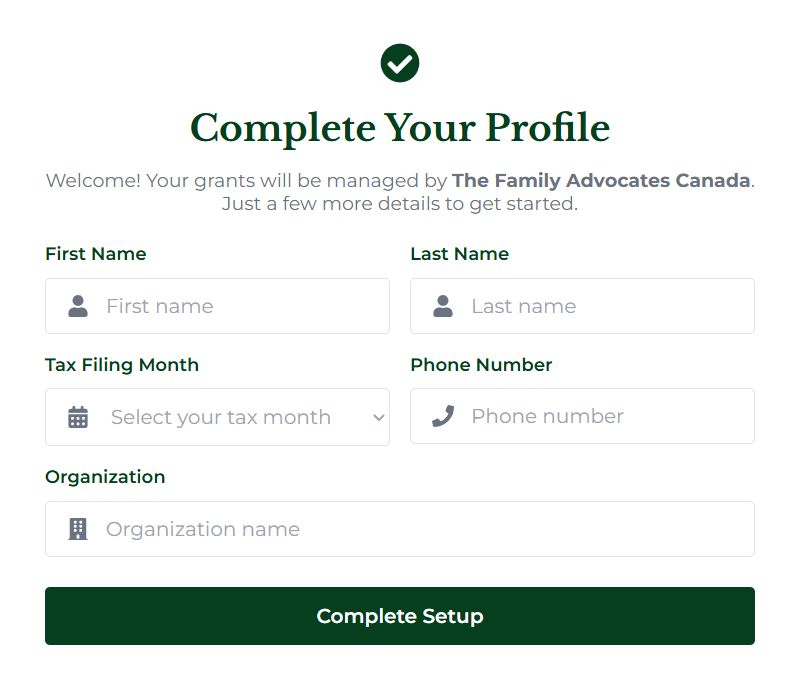

7. Click **Complete Setup**
8. If your account requires a subscription, you'll land on the **Subscription** page to choose a plan (see Section 14). Otherwise, you're redirected to your dashboard.

   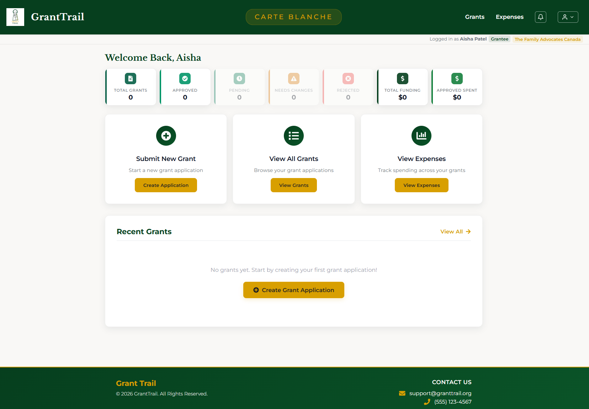

### Open Signup (Self-Service)

1. Go to the signup page directly at `/signup` (no invite link needed)
2. The subtitle reads: **"Create your own workspace to track grants and expenses"**

   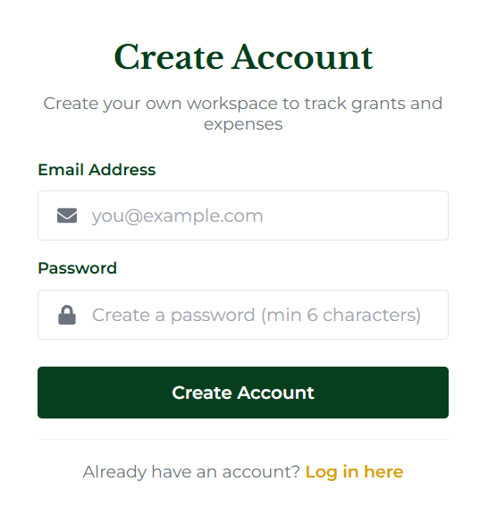

3. Enter your **Email** and choose a **Password** (min 6 characters)
4. Click **Create Account**
5. If email verification is enabled, check your email and click the verification link
6. You land on the **Complete Your Profile** page. The subtitle reads: **"One more step — tell us about yourself to set up your workspace."** Fill in:
   - **First Name** and **Last Name**
   - **Tax Filing Month** (optional dropdown)
   - **Phone Number**
   - **Organization**: This becomes your workspace name
7. Click **Complete Setup**
8. A new workspace is automatically created for you with all records auto-approved
9. If a subscription is required, you'll land on the **Subscription** page to choose a plan (see Section 14). Otherwise, you land on your dashboard.

---

## 2. Logging In

1. Go to `/login`

   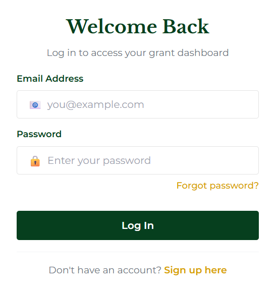

2. Enter your **Email** and **Password**
3. Click **Log In**
4. You're redirected to your dashboard. A **user bar** at the top of every page shows your name, role (e.g. "Grantee"), and tenant name.

   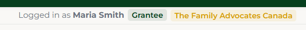

### Forgot Password

1. On the login page, click **Forgot password?**

   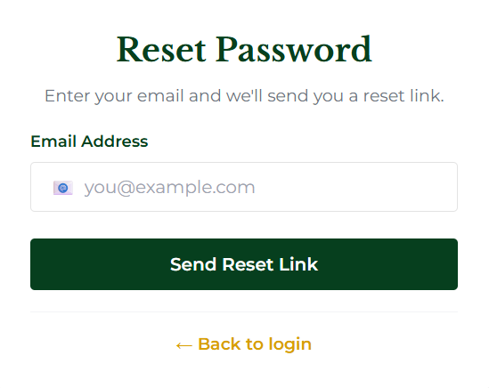

2. Enter your email address
3. Click **Send Reset Link**
4. Check your inbox for the reset email

   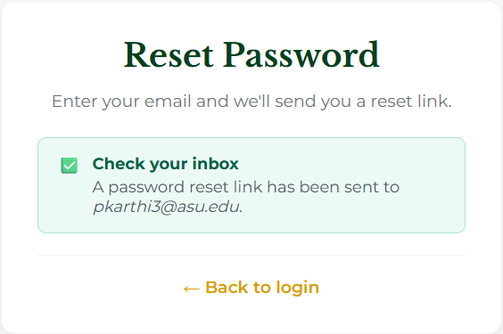

---

## 3. The Dashboard

After logging in, you see your dashboard with:

### Stat Cards

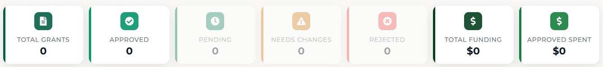

- **Total Grants**: Number of all your grants
- **Approved**: Grants that have been approved
- **Pending**: Grants awaiting admin review (*managed tenants only*)
- **Needs Changes**: Grants returned for revision (*managed tenants only*)
- **Rejected**: Grants that were rejected (*managed tenants only*)
- **Total Funding**: Sum of all grant amounts
- **Approved Spent**: Total of approved expenses

Clicking a stat card takes you to the grants list filtered by that status (e.g. clicking "Approved" shows only approved grants). Cards with a count of zero are dimmed and not clickable.

### Charts
*Once you have at least one grant*

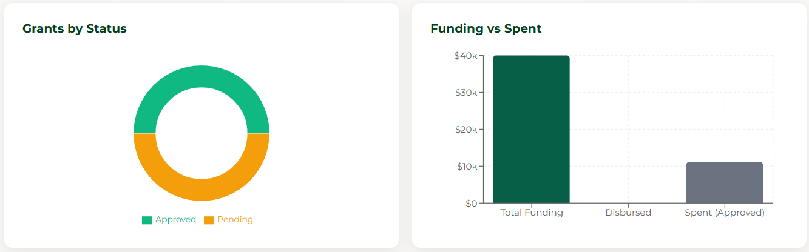

- **Grants by Status**: Pie chart showing the breakdown
- **Funding vs Spent**: Bar chart comparing total funding, disbursed, approved spent, and pending spent amounts

### Quick Actions

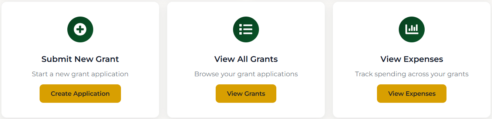

- **Submit New Grant**: Takes you to the grant application form
- **View All Grants**: Takes you to the grants list
- **View Expenses**: Takes you to expense reports

### Recent Grants

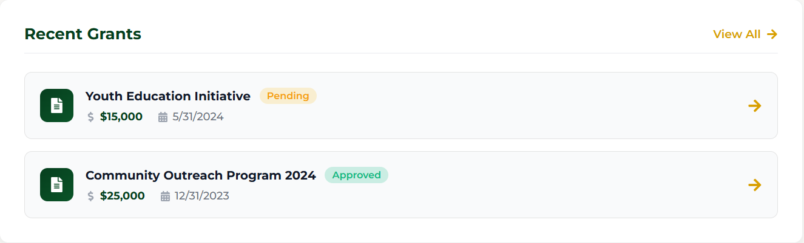

Shows your 5 most recent grants with name, status badge, amount, and date. Click any grant to view its details.

### Tax Month Reminder

If your tax filing month is within 30 days, a green banner appears at the top:

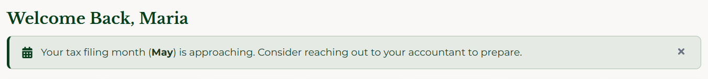

> "Your tax filing month (May) is approaching. Consider reaching out to your accountant to prepare."

Click the **X** to dismiss it for the current session.

---

## 4. Viewing Your Grants

1. Click **Grants** in the navigation bar (or **View All Grants** from the dashboard)

   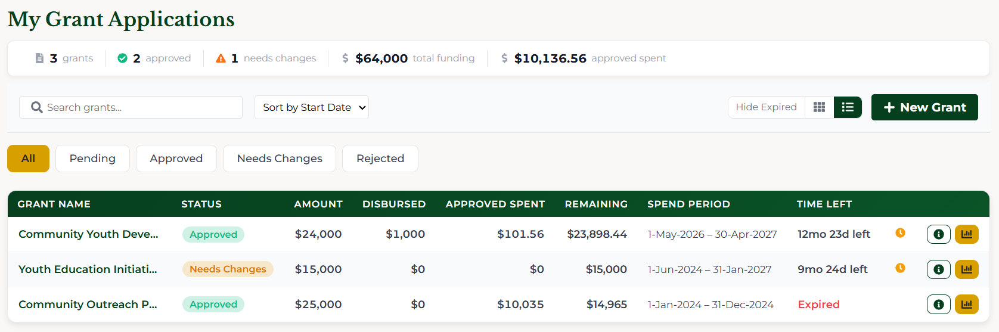

2. A **summary strip** at the top shows totals: Total Grants, Approved, Pending, Needs Changes, Rejected, Total Funding, and Approved Spent (Pending/Needs Changes/Rejected counts only appear for managed tenants).

3. Use the controls below the strip:
   - **Search**: Type to filter by grant name
   - **Status tabs**: Click All, Pending, Approved, Needs Changes, or Rejected to filter (self-service tenants show All and Approved only)
   - **Sort dropdown**: Sort by Start Date, Amount, or Status
   - **Hide Expired**: Toggle to hide grants whose spend period has ended
   - **View toggle**: Switch between Card view and Table view
   - **New Grant** button: Start a new application

### Card View

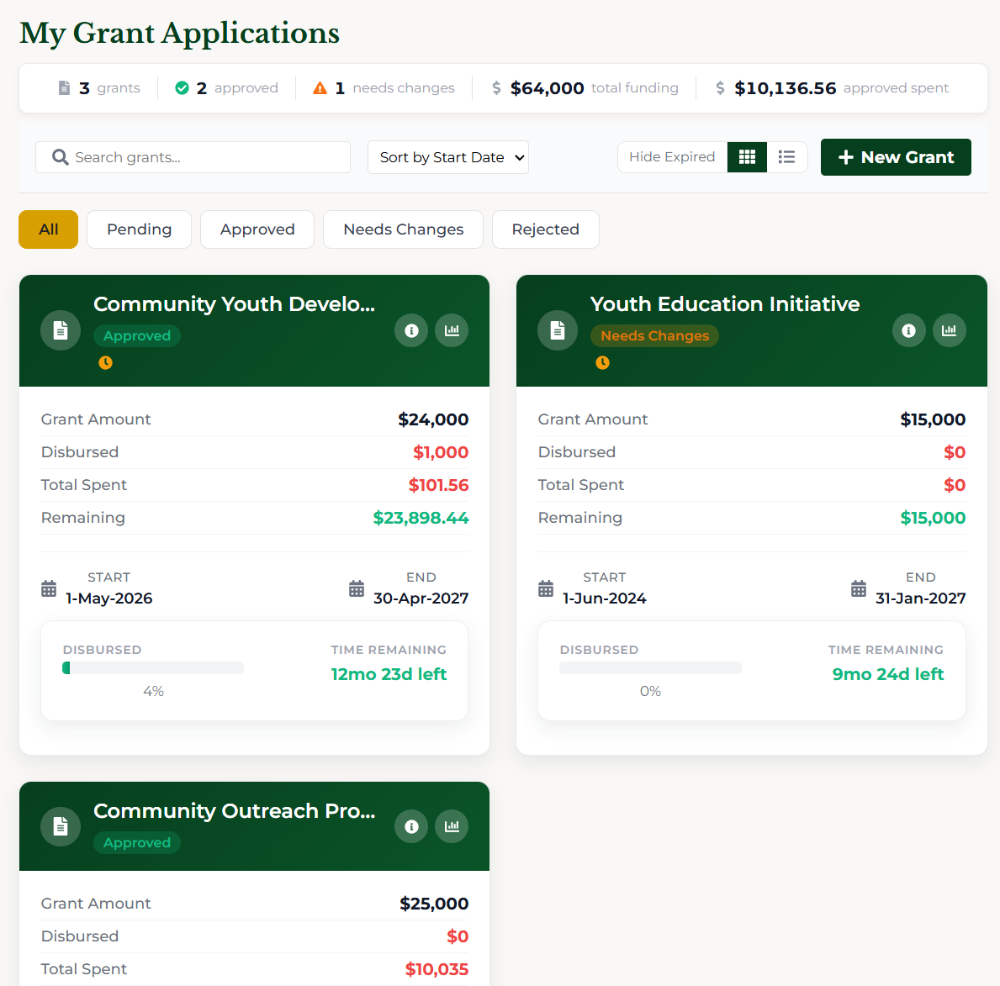

Each card shows the grant name, status, amount, disbursed funds (with progress bar), spent total, remaining balance, spend period, and time remaining. A clock icon appears on grants that have budget items or expenses pending admin review.

Time remaining is color-coded: red when less than 30 days remain, and "Expired" when the spend period has ended.

### Table View

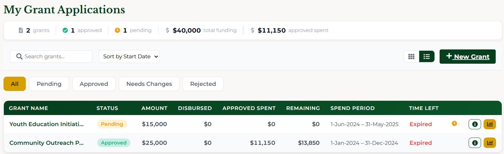

Columns: Grant Name, Status, Amount, Disbursed, Approved Spent, Remaining, Spend Period, Time Left, and action icons. A clock icon appears next to grants with pending items.

### Pagination

The grants list is paginated. Use the **Previous** and **Next** buttons at the bottom to navigate between pages.

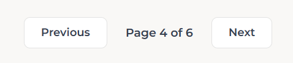

---

## 5. Creating a New Grant Application

1. Click **New Grant** on the grants page, or **Submit New Grant** from the dashboard

   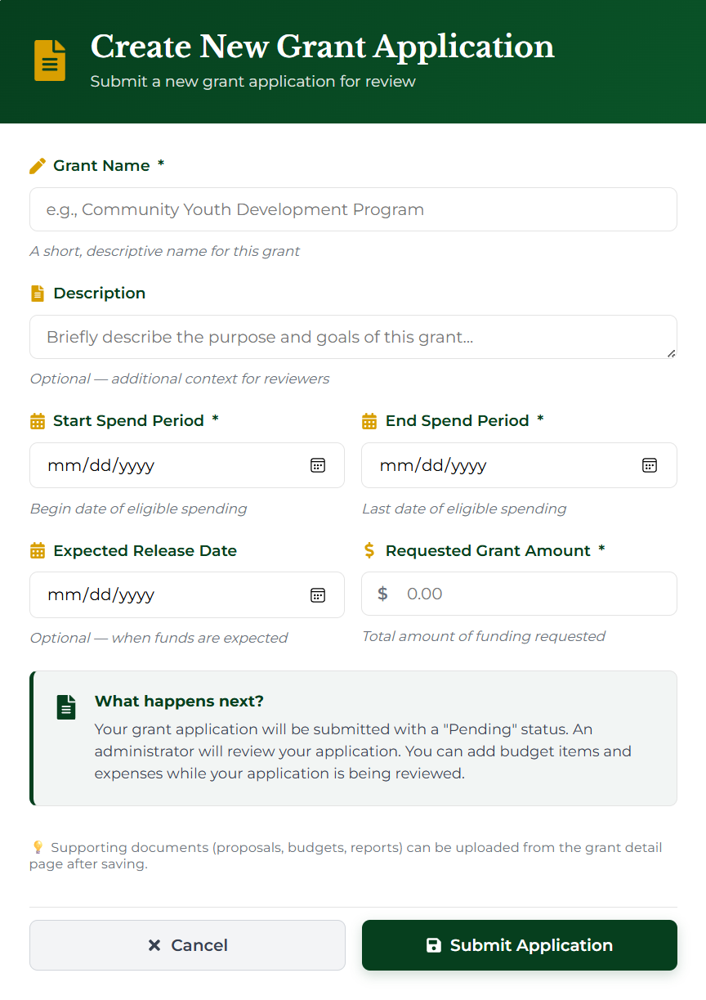

2. Fill in the form:
   - **Grant Name**: A short, descriptive title (e.g. "Community Youth Development Program")
   - **Description** (optional): Purpose and goals of the grant
   - **Start Spend Period**: First date of eligible spending
   - **End Spend Period**: Last date of eligible spending
   - **Expected Release Date** (optional): When funds are expected
   - **Requested Grant Amount**: Total funding requested (e.g. $25,000)

3. Review the info box at the bottom:
   - **Managed tenants:** "Your grant application will be submitted with a 'Pending' status. An administrator will review your application."
   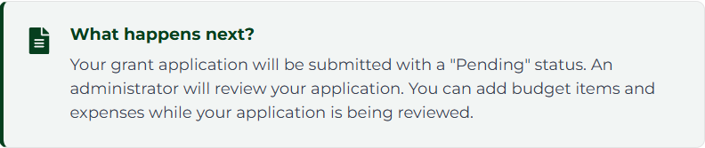
   - **Self-service:** "Your grant application will be automatically approved."
   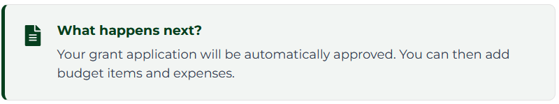

4. A tip below the info box reminds you that supporting documents (proposals, budgets, reports) can be uploaded from the grant detail page after saving.

5. Click **Submit Application**

6. You'll see a success message and be redirected to your grants list

---

## 6. Viewing Grant Details

From the grants list, click a grant name or the info icon

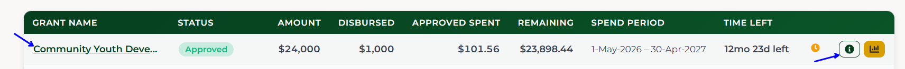

The detail page shows:

### Expired Grant Banner

If the grant's spend period has ended, a banner appears at the top: *"This grant's spend period has ended. You can still add receipts and update records."* Click the **X** to dismiss.

   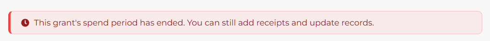

### Header Banner

   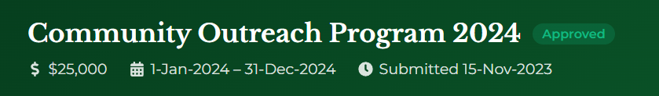

- Grant name with status badge
- Key figures: amount, spend period, submitted date

### Grant Information

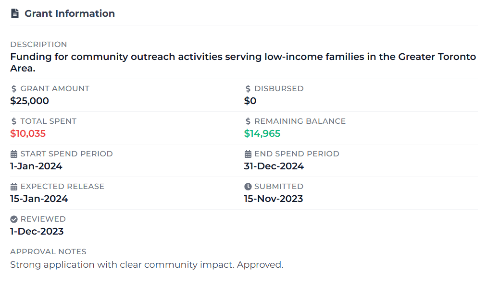

- All financial details: Grant Amount, Disbursed Funds, Total Spent, Remaining Balance
- Dates: Start/End Spend Period, Release Date, Submitted, Last Reviewed
- Approval Notes (if admin has left any)

### Status History

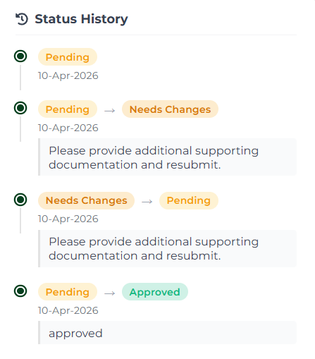

A timeline showing every status transition (e.g. Pending → Approved) with dates and any comments.

### Budget Used Chart

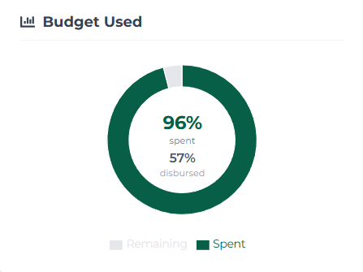

A donut chart showing how much of the grant has been spent vs remaining, with both the spent percentage and disbursed percentage displayed in the center.

### Admin Comments (Managed Tenants Only)

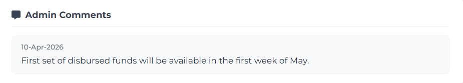

Comments left by the administrator about your grant.

### Grant Documents

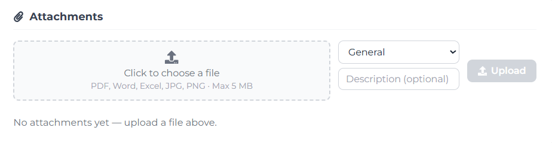

Upload and view supporting documents (proposals, budgets, reports). See Section 10 for details.

### Navigation Links
- **Back to Grants**: Return to the grants list
- **Edit Application**: Visible when the grant has "Needs Changes" status (*managed tenants*) or any time (*self-service tenants*)
- **View Budget & Expenses**: Go to the budget breakdown

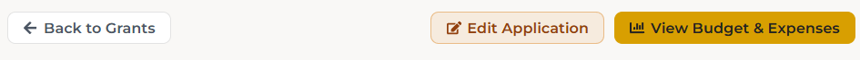

---

## 7. Editing a Grant

### Managed Tenants: Resubmitting After "Needs Changes"

When an admin returns your grant with a "Needs Changes" status:

1. Go to the grant detail page
2. Review the admin's feedback in Status History

   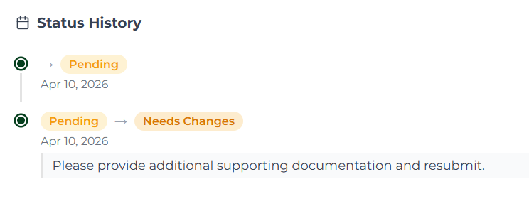

3. Click **Edit Application**

   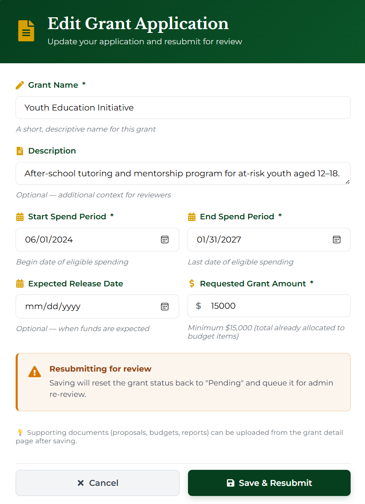

4. Make the necessary changes and click **Save & Resubmit**
5. The grant status returns to "Pending" and goes back into the admin review queue

   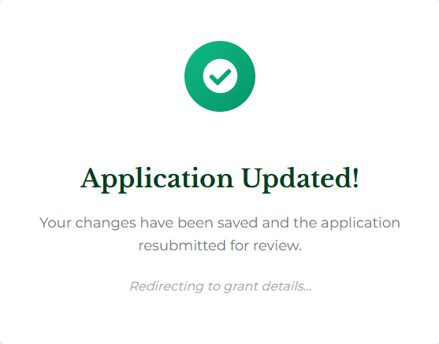

### Self-Service Tenants — Editing Any Grant

Since self-service tenants don't have an approval workflow, you can edit any of your grants at any time:

1. Go to the grant detail page and click **Edit Application**
2. Update any fields (name, dates, amount, description)
3. Click **Save Changes**
4. Your changes are saved immediately. The grant stays approved and no re-review is needed

---

## 8. Managing Budget Items

1. From a grant detail page, click **View Budget & Expenses**

   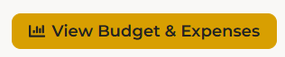

2. If the grant's spend period has ended, an **expired grant banner** appears at the top (same as the grant detail page).

   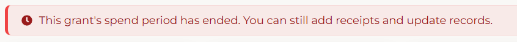

3. The breakdown page shows:

   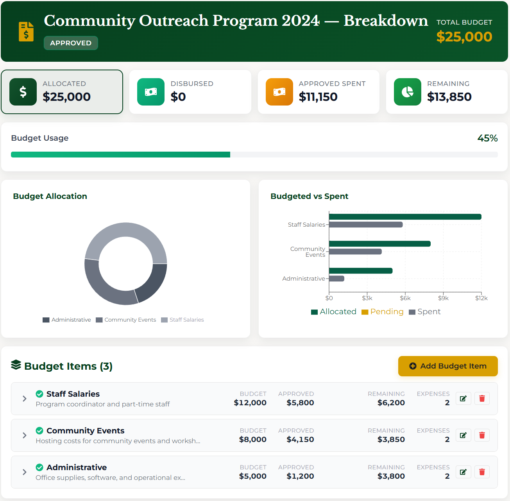

   - **Summary cards**: Allocated, Disbursed, Approved Spent (with a "+ $X pending" sub-label when pending expenses exist), and Remaining. Cards change appearance when the budget is fully allocated or fully disbursed.
   - **Charts**: Budget Allocation (pie) and Budgeted vs Spent (bar). The bar chart shows three bars per budget item: allocated (green), approved spent (gray), and pending (orange).
   - **Budget Items list** below the charts

4. Each budget item row is **collapsible**: click the row or chevron to expand and see the expenses underneath. In managed tenants, badge counts show the number of pending and rejected expenses per budget item. Budget items also display a status badge (managed tenants only).

   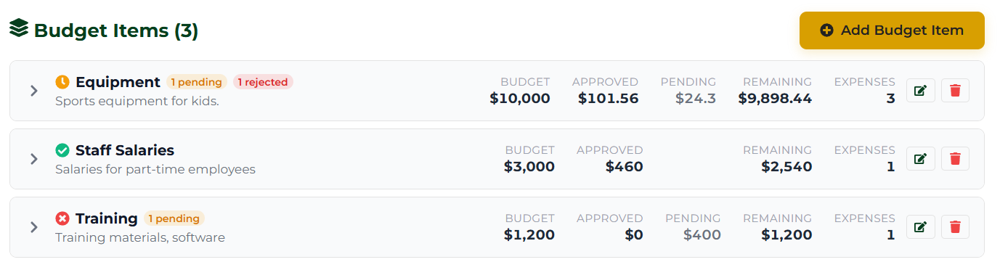

   First item expanded:

   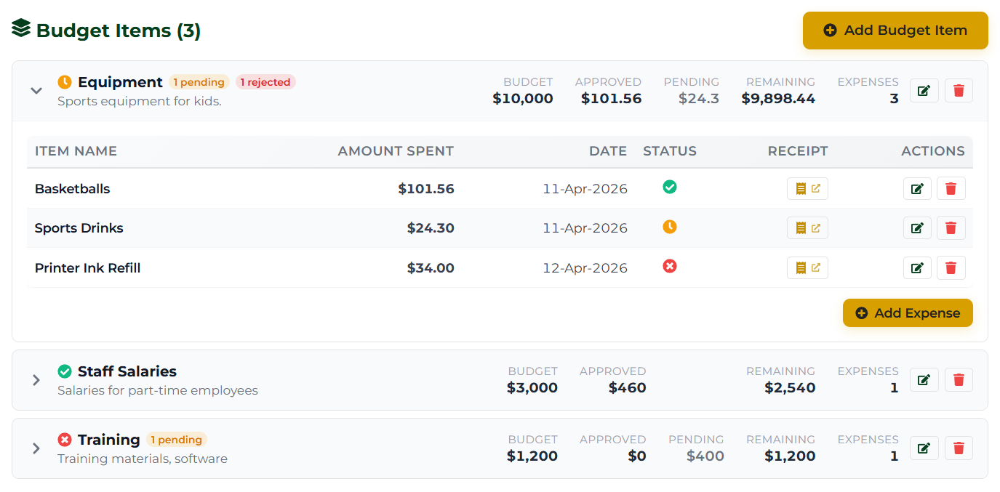

5. If no budget items exist yet, an empty state message appears with an **Add Your First Budget Item** button.

### Adding a Budget Item

1. Click **Add Budget Item**

   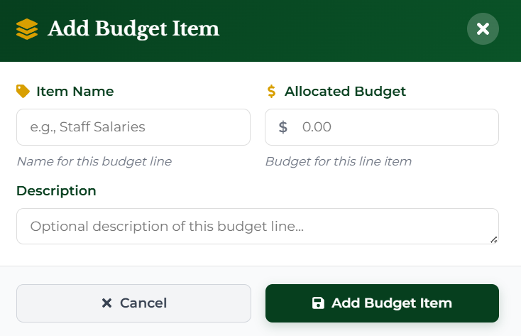

2. Fill in:
   - **Item Name** (e.g. "Staff Salaries")
   - **Description** (optional)
   - **Budget Allocated** (dollar amount)
3. Click **Save**
4. The item appears in the list

   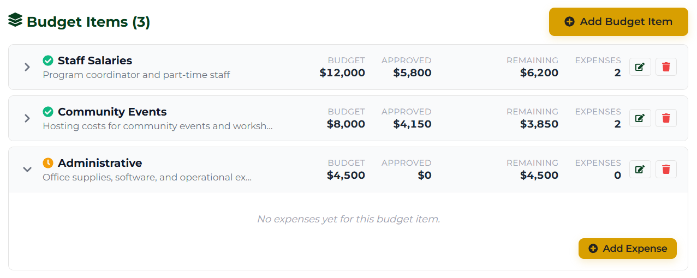

### Editing a Budget Item

> ℹ️ **Managed tenants:** Saving changes to an "Approved" or "Rejected" budget item resets the item to "Pending" for admin re-review. This note shows up in the edit budget screen.

1. Click the **pencil icon** next to the budget item

   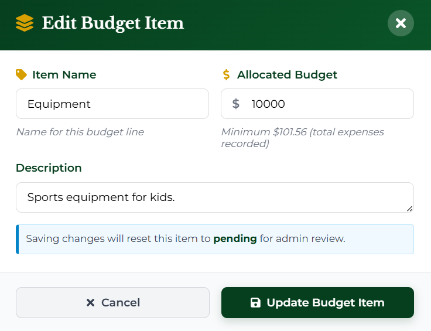

2. Update the fields. The allocated budget cannot be set below the total expenses already recorded against this item

3. Click **Update Budget Item**

### Deleting a Budget Item

> ⚠️ Deleting a budget item also deletes all expenses recorded under it. Grant totals are recalculated automatically.

1. Click the **trash icon** next to the budget item
2. Click again to confirm (two-click delete)

   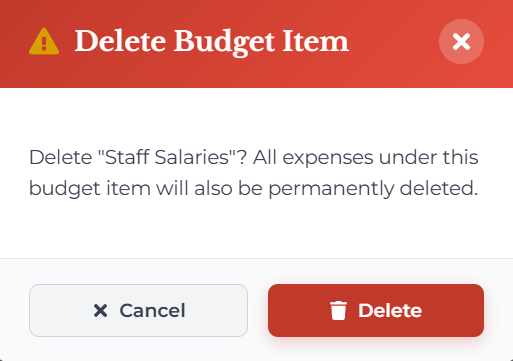

---

## 9. Logging Expenses

### Adding an Expense

1. In the budget breakdown page, expand a budget item
2. Click **Add Expense**

   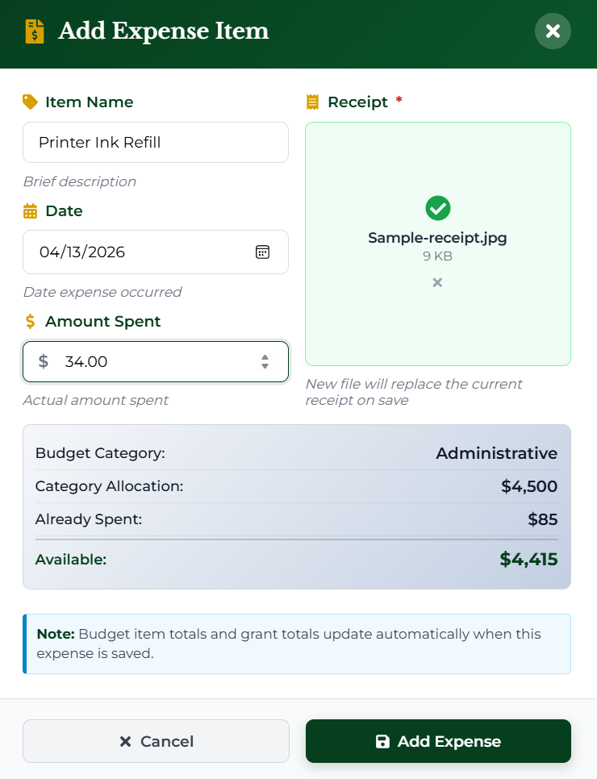

3. The screen has a split layout: form fields on the left, receipt upload on the right. Fill in:
   - **Item Name**: Description of the expense (e.g. "Office Supplies Q1")
   - **Amount Spent**: Dollar amount (cannot exceed the available budget for this category)
   - **Expense Date**: When the expense occurred. A yellow warning appears if the date falls outside the grant's spend period.
   - **Receipt**: Upload a receipt file (JPG, PNG, or PDF, max 500 KB). Required in managed tenants; optional in self-service.

4. A **budget info box** below the form shows the category allocation, amount already spent, and available balance.

   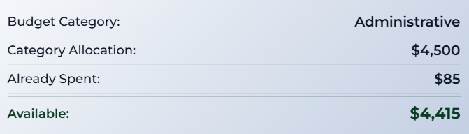

5. Click **Save**
6. The expense appears in the table under the budget item

   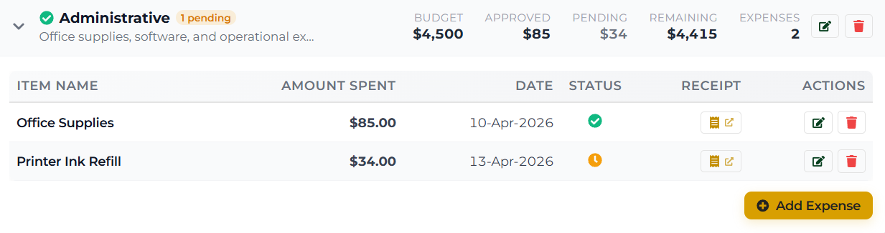

### Editing an Expense

1. Click the **pencil icon** on the expense row
2. Update the fields. If a receipt is already on file, a **Replace** button appears to swap it out; otherwise the upload area is shown.
3. Click **Update Expense**

> ℹ️ **Managed tenants:** Saving changes to an "Approved" or "Rejected" expense resets it to "Pending" for admin re-review. 

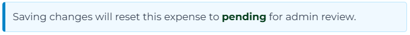

### Deleting an Expense

> ℹ️ Deleting an expense updates the budget item and grant totals automatically.

1. Click the **trash icon** on the expense row
2. Click again to confirm

   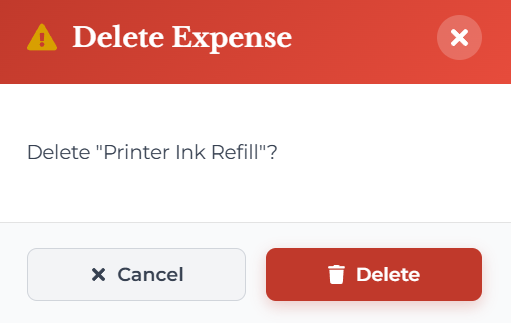

### Viewing a Receipt

1. Click the **receipt icon** on an expense row
2. A signed URL opens in a new tab (valid for 60 seconds)

   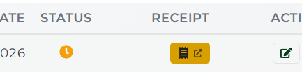

---

## 10. Uploading Grant Documents

1. Go to the grant detail page and scroll to the **Grant Documents** section

   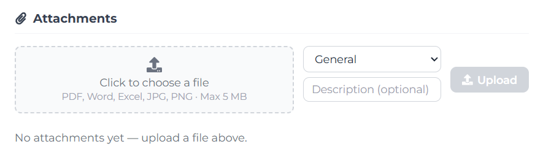

2. Choose a **Category**: Proposal, Budget, Report, or General
3. Add a **Description** (optional)
4. Click **Choose File** and select your document (PDF, JPG, PNG, DOC, DOCX, XLS, XLSX — max 5 MB)
5. Click **Upload**

   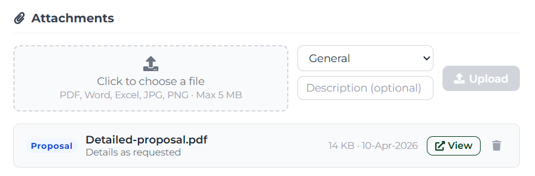

6. Each uploaded document shows its filename, file size, upload date, category badge, and description (if provided)
7. To view a document, click its name — a signed URL opens in a new tab
8. To delete, click the **trash icon** and confirm (two-click delete)

---

## 11. Viewing Expense Reports

1. Click **Expenses** in the navigation bar

   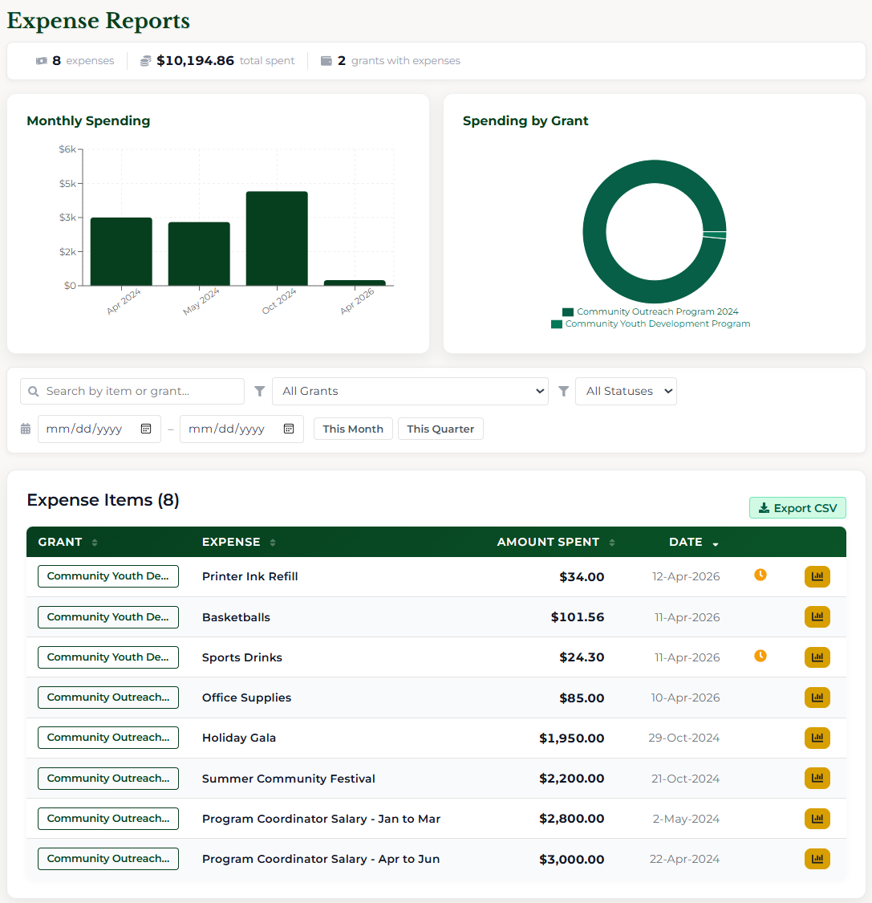

2. The page shows:

### Summary Stats
- Total expenses count
- Total spent amount
- Number of grants with expenses

### Charts

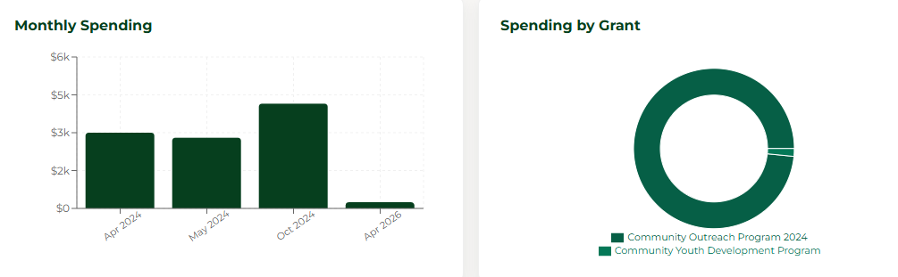

- **Monthly Spending**: Bar chart of expenses by month
- **Spending by Grant**: Pie chart showing top grants by spending (if more than 8 grants have expenses, the remainder are grouped as "Other")

### Expense Table

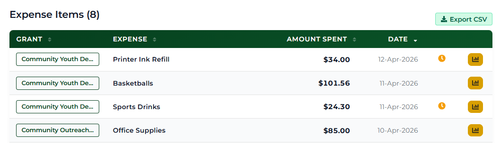

- Columns: Grant, Expense Item, Amount, Date, Status
- Click any **column header** to sort ascending/descending (a sort arrow indicates the active sort)
- Click a **grant name badge** to jump to that grant's breakdown (hover to see the full name in a tooltip)

### Exporting Expenses

Two export options are available:

- **Export CSV**: Downloads the currently filtered and sorted expenses as a CSV file. Available to all users.
- **Export Excel**: Downloads a multi-sheet Excel workbook with one sheet per month, including grant metadata, budget vs actual comparisons, and running totals. Requires a **Premium subscription** (see Section 14). If you don't have Premium, the button reads "Upgrade for Excel" and links to the Subscription page.

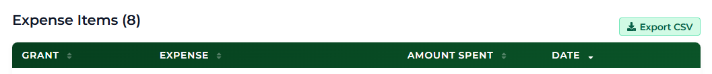

### Filtering

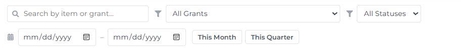

- **Search**: Filter by expense item name or grant name
- **Grant dropdown**: Show expenses for all grants or only a specific grant
- **Status dropdown**: All, Approved, Pending, or Rejected
- **Date range**: Pick start and end dates
- **Quick presets**: "This Month" or "This Quarter"
- Click **Clear** to reset all filters

---

## 12. Notifications

### The Notification Bell

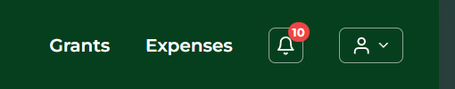

A bell icon in the header shows your unread notification count (capped at "99+"). Clicking the bell opens a dropdown panel.

### Viewing Notifications

1. Click the bell icon to open the notification panel

   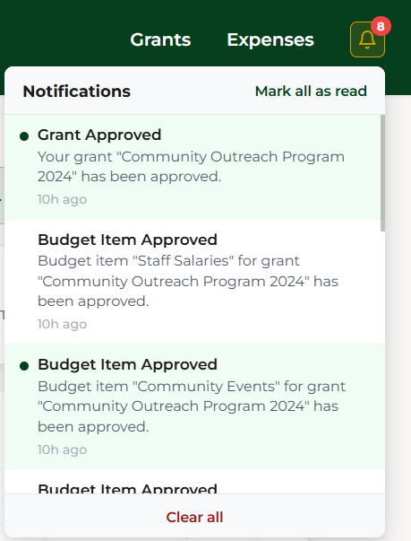

2. Each notification shows:
   - A **green dot** for unread notifications
   - **Title** (e.g. "Grant Approved")
   - **Message** (e.g. "Your grant 'Community Outreach Program 2024' has been approved.")
   - **Time** (e.g. "10h ago")

3. Click a notification to:
   - Mark it as read
   - Navigate to the related page

### Managing Notifications

- **Mark all as read**: Removes all blue dots (appears when unread notifications exist)

   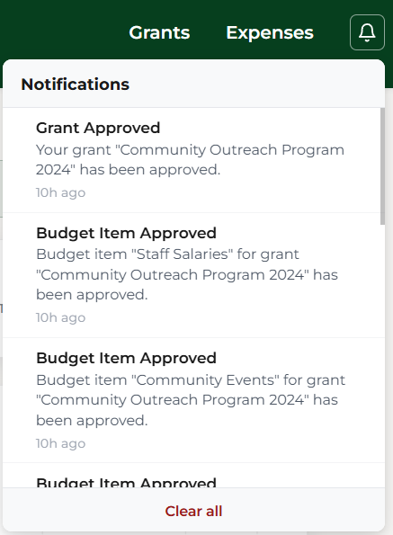

- **Clear all**: Removes all notifications from the list

   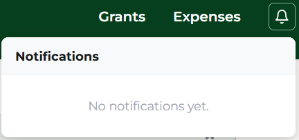

When there are no notifications, the panel shows "No notifications yet."

---

## 13. Footer

The footer appears at the bottom of every page and shows:

- **Support contact**: Email and phone number for your tenant's support team (clickable `mailto:` and `tel:` links). If your tenant hasn't configured contact info, a platform-wide default is shown.
- **Copyright**: Current year and GrantTrail branding.

---

## 14. Subscription & Membership

A subscription is required to use GrantTrail's grant and expense features. The **Subscription** link in the navigation bar takes you to the membership page.

### Who needs a subscription?

| User type | Subscription required? |
|-----------|----------------------|
| Grantees (managed or self-service) | Yes, unless waived by an administrator or the tenant is exempt |
| Tenant admins | No (automatically exempt) |
| Super admins | No (automatically exempt) |

### Plans

| Plan | What's included |
|------|----------------|
| **Basic** | Full access to grants, budgets, expenses, receipts, and standard reporting |
| **Premium** | Everything in Basic, plus Excel export for expense breakdowns |

### The Subscription Page

   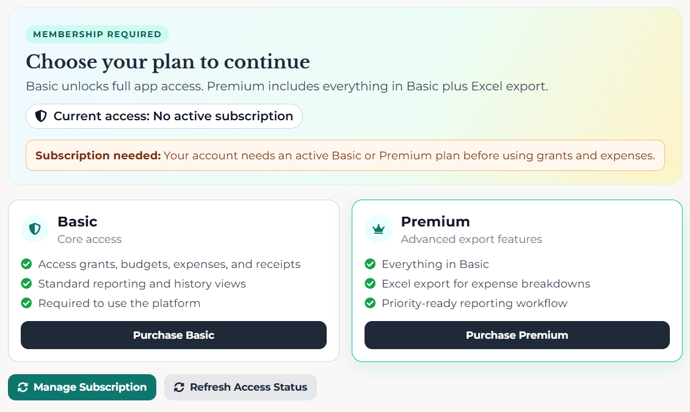

The page shows:

- **Status chip**: Your current access level (e.g. "No active subscription", "Basic (Paid)", "Premium (Paid)", "Premium (subscription waived by your administrator)", or "Full Access (subscription not required for your account)")
- **Plan cards**: Basic and Premium with feature lists. Disabled if you already have that plan or higher.
- **Manage Subscription**: Opens the Stripe billing portal to update payment method, view invoices, or cancel (only shown for Stripe subscriptions)
- **Refresh Access Status**: Reloads your membership status from the server (useful after an admin waives your subscription or you complete a purchase)

### Purchasing a Plan

1. Click **Purchase Basic** or **Purchase Premium**
2. You're redirected to the Stripe checkout page

   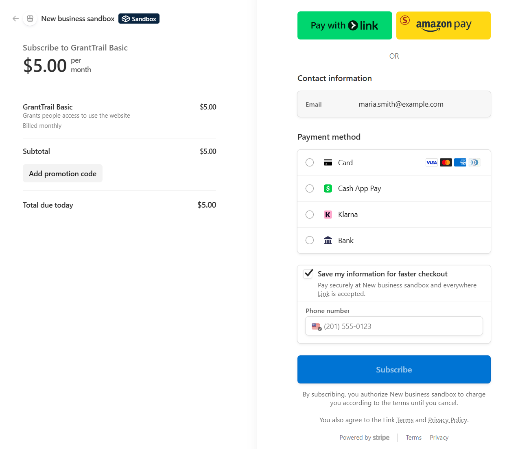

3. Enter your payment details and complete the purchase
4. You're redirected back to the Subscription page
5. Click **Refresh Access Status** to update your access
6. You can now navigate to the dashboard and use all features

### If Your Subscription is Waived

Your administrator can waive the subscription requirement for your account. When waived:

- The status chip shows **"Premium (subscription waived by your administrator)"**
- Both plan cards are disabled (no purchase needed)
- The "Manage Subscription" button is hidden
- You have full access to all features including Excel export

   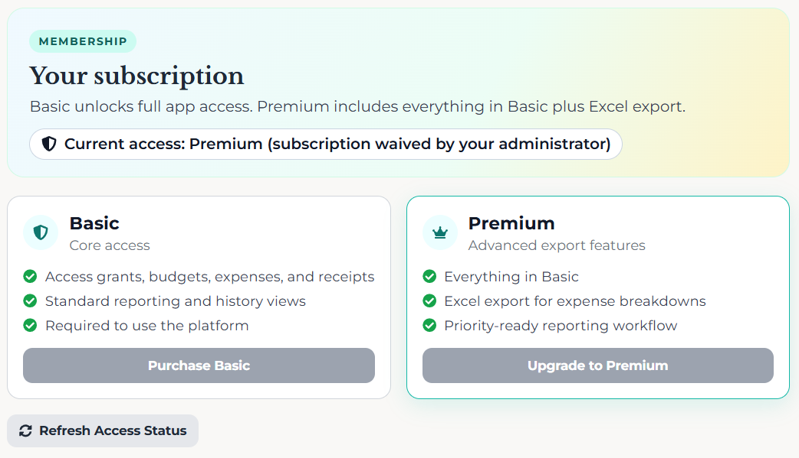

### If Your Tenant is Exempt

A super admin can exempt your entire tenant from requiring subscriptions. When exempt:

- The status chip shows **"Full Access (subscription not required for your account)"**
- Both plan cards are disabled
- You have full access without any purchase

   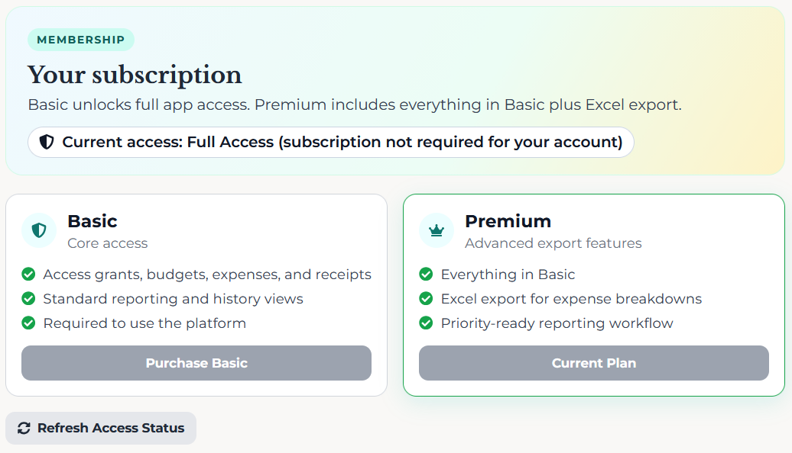
