# Tenant Admin Step-by-Step Walkthrough

This guide walks through every task a tenant administrator can perform in GrantTrail. This applies to **managed tenants** only. Self-service tenants do not have an admin role.

> **Tenant** = the entity that is responsible for reviewing, approving, rejecting and managing grants (your GrantTrail account). 
> **Organization** = the entity that the grantee represents or works for (entered by each grantee during signup). 
> For example, TFAC is a tenant. They use GrantTrail to manage grants. Each invited grantee enters their own organization name (e.g., "Helping Hands Foundation"), so TFAC manages grantees from Helping Hands, Hope Foundation, and others.

## Table of Contents

- [Quick Reference](#quick-reference)
- [1. Logging In](#logging-in)
- [2. The Admin Dashboard](#the-admin-dashboard)
- [3. Viewing All Grants](#viewing-all-grants)
- [4. Reviewing a Grant Application](#reviewing-a-grant-application)
- [5. Approving Budget Items](#approving-budget-items)
- [6. Approving Expenses](#approving-expenses)
- [7. Managing Users](#managing-users)
- [8. Inviting New Users](#inviting-new-users)
- [9. Configuring Approval Settings](#configuring-approval-settings)
- [10. Viewing the Audit Log](#viewing-the-audit-log)
- [11. Notifications](#notifications)
- [12. Configuring Support Contact](#configuring-support-contact)
- [13. Managing Grantee Subscriptions](#managing-grantee-subscriptions)

---

## Quick Reference

| I want to... | Where to go | What to do |
|------------|-------------|------------|
| **See grants waiting for review** | Dashboard → Review Queue | Click Review on any pending grant, or go to All Grants and filter by Pending |
| **Approve or reject a grant** | All Grants → click arrow (→) | Change the Status dropdown, add Approval Notes, click Update Status |
| **Request changes from a grantee** | Grant review page | Set status to Needs Changes, explain what to fix in Approval Notes |
| **Leave a comment for a grantee** | Grant review page → Comments section | Type your comment and submit. Grantees see it on their View Details page |
| **Approve a budget item** | Grant review page → Budget & Expense Review | Click Approve or Reject next to the item |
| **Approve an expense** | Grant review page → Budget & Expense Review | Expand the budget item and click Approve or Reject on the expense |
| **Find a specific grant** | All Grants | Use the search bar or status filter at the top of the table |
| **Change a user's role** | Profile menu → Users → Actions column | Click Make Admin or Make Grantee, then confirm |
| **Disable a user account** | Profile menu → Users → Actions column | Click Disable, then confirm |
| **Invite a new user** | Profile menu → Users → Invite User | Generate invite links from User Management page |
| **Configure approval settings** | Profile menu → Settings | Toggle approval workflows on/off for grants, budgets, and expenses |
| **Export grants to CSV** | All Grants → Export CSV | Downloads the current filtered grant list as a CSV file |
| **Check who made a change** | Profile menu → Audit Log | Filter by table, user, and/or date range; click a row to see field changes |
| **Waive a grantee's subscription** | Profile menu → Users → Actions column | Click Waive next to the grantee (see Section 13) |
| **Check a grantee's subscription** | Profile menu → Users → Subscription column | Badge shows None, Basic (Paid), Premium (Paid), Waived, or Exempt |

**ℹ️ What counts toward spending totals:** Only **approved** expenses are included in a grant's Total Spent and Remaining Balance. Pending and rejected expenses are tracked but excluded from all totals.

**⚠️ Cascade rule:** Rejecting a budget item automatically resets all of its linked expenses back to **Pending**.

---

## 1. Logging In

1. Go to `/login`
2. Enter your **Email** and **Password**
3. Click **Log In**
4. You're redirected to the **Admin Dashboard**

   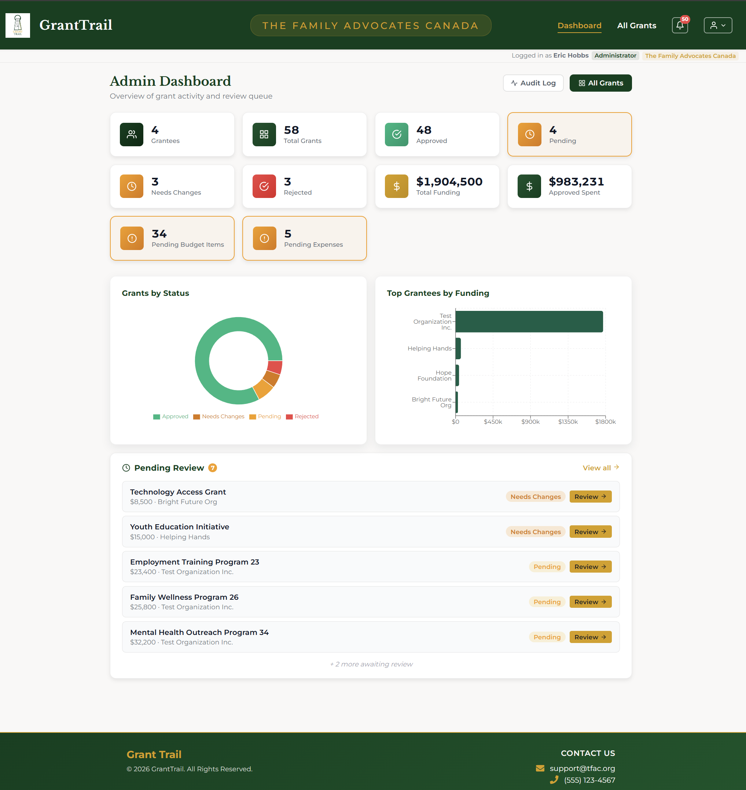

---

## 2. The Admin Dashboard

### Stat Cards

   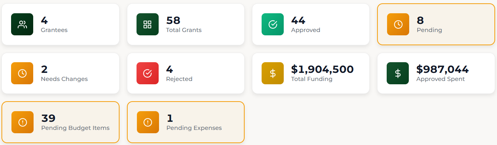

The top row shows key metrics at a glance:

- **Grantees**: Total grantee users in your tenant
- **Total Grants**: All grants submitted
- **Approved** / **Pending** / **Needs Changes** / **Rejected**: Grant counts by status (cards only appear when count is greater than zero)
  - Clicking these cards takes you directly to the All Grants page filtered to show the relevant items.
- **Total Funding**: Sum of all grant amounts
- **Approved Spent**: Total of approved expenses
- **Pending Budget Items** / **Pending Expenses**: Items awaiting your review (only appear when count is greater than zero). 
  - Clicking these cards takes you directly to the All Grants page filtered to show the relevant pending items.

### Charts

   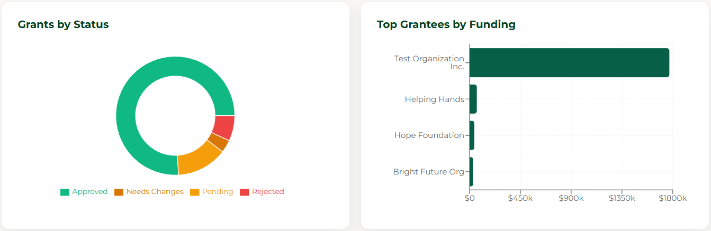

- **Grants by Status**: Pie chart of grant statuses
- **Top Grantees by Funding**: Horizontal bar chart showing top funded grantees

### Pending Review Queue

   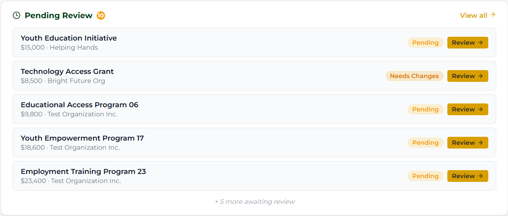

Shows up to 5 grants awaiting review. Each item shows:

- Grant name
- Amount and organization
- Status badge
- **Review** button (links to grant review page)

If more than 5 grants are pending, a "+X more awaiting review" message appears. Click **Review** to go directly to the grant review page. Click **View all** to see the full grants list filtered to pending.

> ℹ️ This section is hidden if grant approval is turned off in Settings.

> ℹ️ If your tenant has no support email or phone configured, an amber nudge banner appears on the dashboard with a link to Settings to set up contact info.

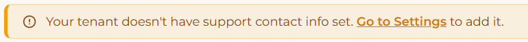

---

## 3. Viewing All Grants

1. Click **All Grants** in the navigation bar

   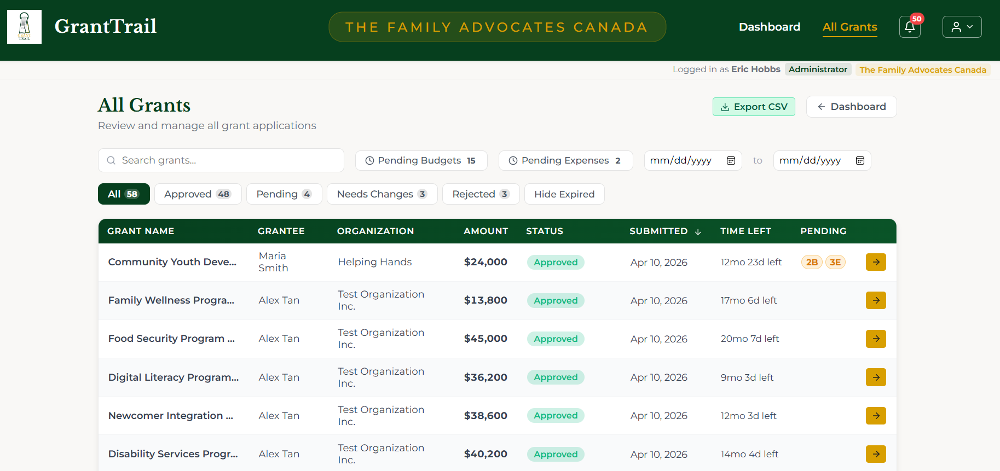

2. The grants table shows all grants across all grantees in your tenant

### Filtering and Searching

   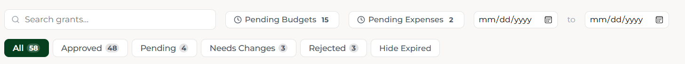

- **Search bar**: Search by grant name, grantee name, or organization
- **Pending Budgets** / **Pending Expenses**: Two separate toggle buttons to show only grants with pending budget items or pending expenses (each shows a count badge)
- **Status tabs**: All, Approved, Pending, Needs Changes, Rejected (each with count)
- **Date range**: Filter by submission date (From / To)
- **Hide Expired**: Toggle to hide grants whose spend period has ended

### Table Columns

- Grant Name
- Grantee (name)
- Organization
- Amount
- Status
- Submitted (date)
- Time Left (color-coded: red if < 30 days)
- Pending items: Shows shorthand like "2B 3E" (2 pending budgets, 3 pending expenses)
- Arrow button (→) to open the grant review page

Click any **column header** to sort ascending/descending (a sort arrow indicates the active column and direction).

3. Click the **arrow button (→)** on any grant to open the review page

### Exporting Grants

Click **Export CSV** in the page header to download the current filtered grant list as a CSV file (includes grant name, grantee, organization, amount, status, submitted date, total spent, remaining).

   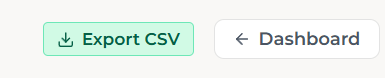

---

## 4. Reviewing a Grant Application

From All Grants, click the **arrow button (→)** on a grant. Or from the Review Queue, click **Review**.

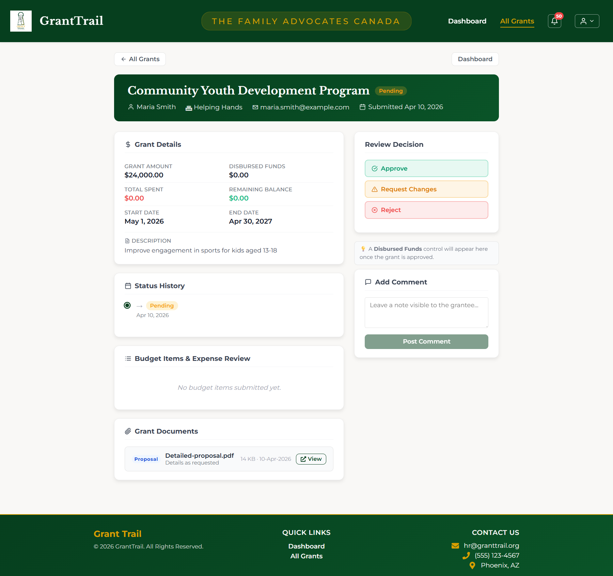

If the grant's spend period has ended, an **expired grant warning banner** appears at the top of the page.

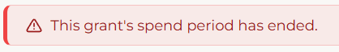

The review page has two panels:

### Left Panel: Grant Information

#### Grant Details Card

   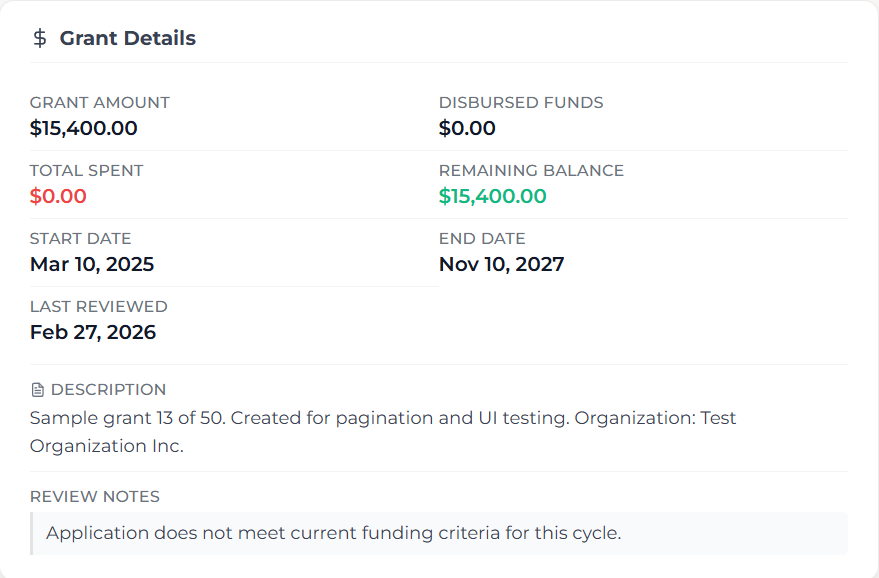

- Grant Amount, Disbursed Funds, Total Spent, Remaining Balance
- Start/End dates, Release Date, Submitted date
- Description and existing Review Notes

#### Status History

   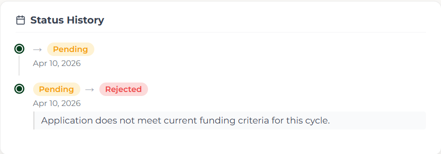

Timeline showing every status change with dates and notes.

#### Comments

   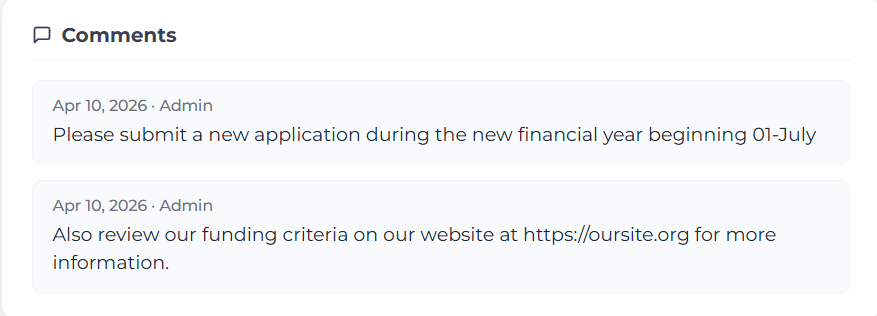

Previous posted admin comments on this grant. This section only appears if comments exist.

#### Budget Items & Expense Review

   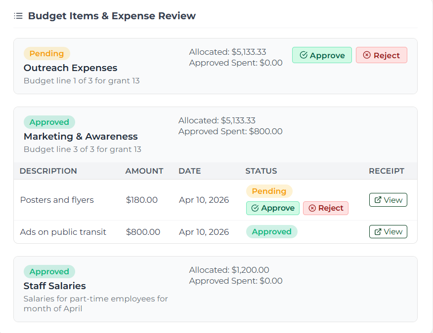

Each **budget item** shows its status badge, name, description, allocated amount, and approved spent, with **Approve** and **Reject** buttons (visible when status is Pending).

**Expenses** are listed directly below each budget item, showing item name, amount, date, status, and receipt link, with **Approve** and **Reject** buttons per expense.

> ℹ️ This section is hidden when both budget and expense approval are turned off in Settings.

#### Grant Documents

   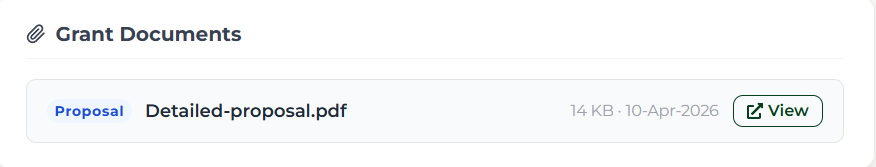

View uploaded documents. These are read-only in the admin view. You cannot upload or delete.

### Right Sidebar: Actions

#### Making a Review Decision

   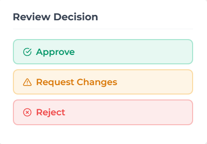

1. Click one of three action buttons:
   - **Approve**: Approve the grant
   - **Request Changes**: Return to grantee for revisions
   - **Reject**: Reject the grant

2. A notes field appears:

   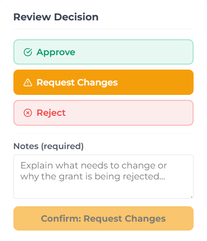

   - **Approve**: Notes are optional
   - **Request Changes**: Notes are required. Explain what needs to change
   - **Reject**: Notes are required. Explain the reason

3. Click **Confirm: [Action]**

   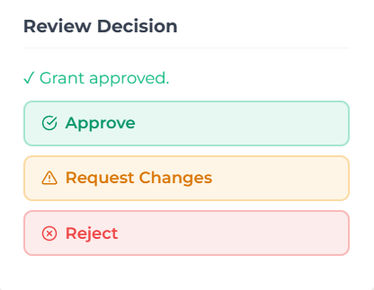

4. A success message appears (e.g. "Grant approved.") and the page refreshes

#### Setting Disbursed Funds

   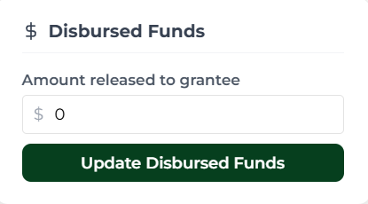

This card appears only after a grant is approved:

1. Enter the dollar amount released to the grantee
2. Click **Update Disbursed Funds**
3. The amount updates across the grantee's dashboard and grant views

> ℹ️ Before approval, a tip appears: "A Disbursed Funds control will appear here once the grant is approved."

   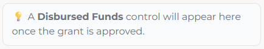

#### Adding a Comment

   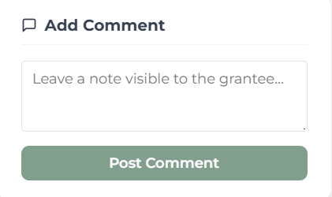

1. Scroll to the **Add Comment** section in the sidebar
2. Type your comment in the textarea
3. Click **Post Comment**
4. A success message appears briefly ("Comment posted successfully.") and the comment appears in the Comments section. The grantee receives a notification.

---

## 5. Approving Budget Items

1. On the grant review page, scroll to **Budget Items & Expense Review**

   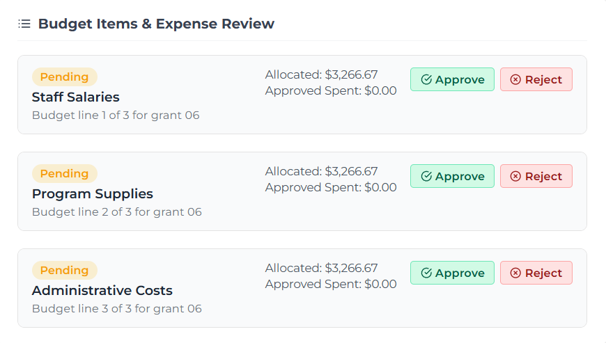

2. For each pending budget item:
   - Click **Approve** to approve it
   - Click **Reject** to reject it

   The Approve and Reject buttons are only visible for items with "Pending" status. Already approved or rejected items show their status badge but no action buttons.

3. The status badge updates immediately
4. The grantee receives a notification

> ⚠️ When a budget item is rejected, all its linked expenses are reset to Pending so you can handle them individually.

---

## 6. Approving Expenses

1. On the grant review page, expenses show up under their budget item

   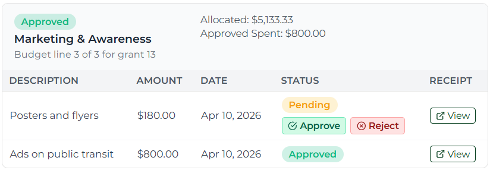

2. For each pending expense:
   - Click **Approve**: The expense amount counts toward totals
   - Click **Reject**: The expense is excluded from totals

   The Approve and Reject buttons are only visible for expenses with "Pending" status.

3. To view a receipt, click the **View** button: It opens in a new tab via a signed URL

   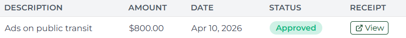

4. The grantee receives a notification for each approval/rejection

---

## 7. Managing Users

1. Click your **profile icon** in the header
2. Click **Users** from the dropdown

   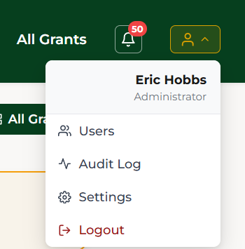

### User List

   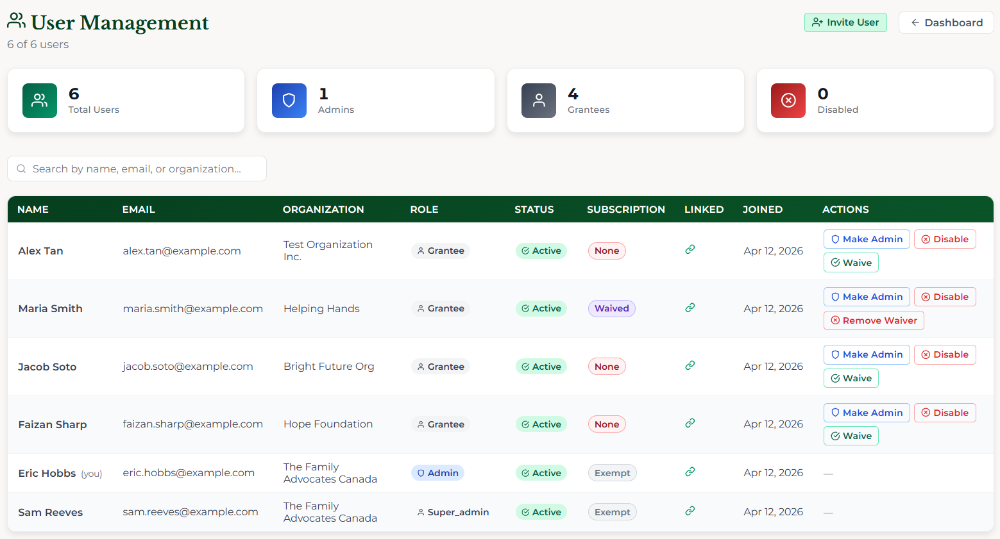

The page shows all users in your tenant with:

- **Stat cards**: Total Users, Admins, Grantees, Disabled
- **Search bar**: Filter by name, email, or organization
- **Table**: Name, Email, Organization, Role, Status, Subscription, Linked, Joined, Actions

The **Subscription** column shows a color-coded badge for each grantee's membership status:

| Badge | Color | Meaning |
|-------|-------|---------|
| **Exempt** | Gray | User is an admin or super_admin (automatic) |
| **Premium (Paid)** | Gold | Active Stripe premium subscription |
| **Basic (Paid)** | Green | Active Stripe basic subscription |
| **Waived** | Purple | Subscription waived by admin (see Section 13) |
| **None** | Red | No subscription — user is blocked from grants and expenses |

The **Linked** column shows whether the user's auth account is connected: a green link icon means linked, a red alert icon means not yet linked (hover for details). Super admin users appear in the list but show "—" in the Actions column. They cannot be modified by tenant admins.

### Changing a User's Role

   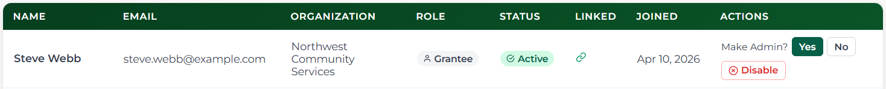

1. Find the user in the table
2. Click **Make Admin** or **Make Grantee**
3. A confirmation appears: "Make Admin?" with **Yes** / **No**
4. Click **Yes** to confirm

> ℹ️ You cannot change your own role.

   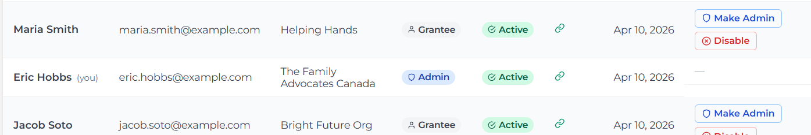

### Disabling a User

   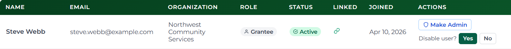

1. Click **Disable** next to the user
2. Confirm with **Yes**
3. The user's status changes to "Disabled"

   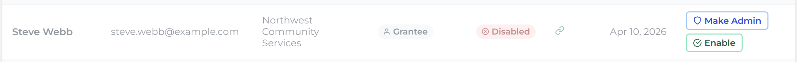

4. They will see an "Account Disabled" message on their next login

   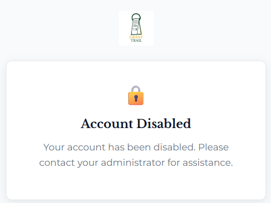

### Re-enabling a User

1. Click **Enable** next to a disabled user
2. Confirm with **Yes**

   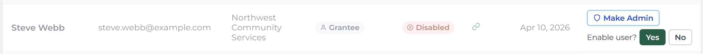

---

## 8. Inviting New Users

1. On the User Management page, click **Invite User**

   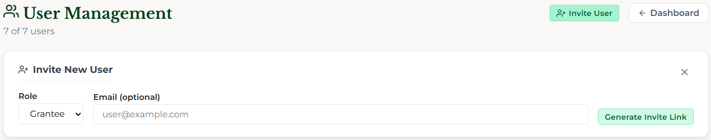

2. Select a **Role**:
   - **Grantee**: Can submit grants and log expenses
   - **Admin**: Can review grants and manage users

3. Optionally enter an **Email**: If provided, the signup form will pre-fill and lock that email

4. Click **Generate Invite Link**

   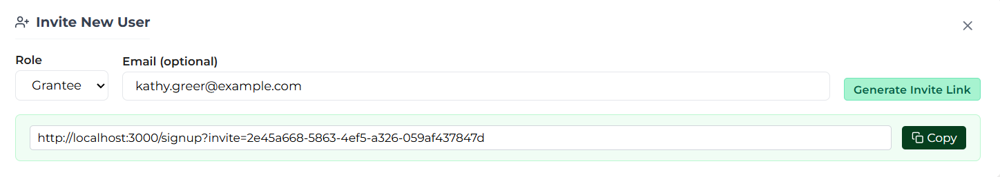

5. A link appears in a green box. Click **Copy** to copy it to your clipboard

6. Share the link with the new user (via email, chat, etc.)

The invited user's signup is a two-step process. See the *Grantee Walkthrough* document for more details.

- **Step 1:** They enter their email and password on the signup page
- **Step 2:** They complete their profile (name, phone, organization) on a separate page
- After completing their profile, grantees who need a subscription will land on the **Subscription** page to choose a plan. You can waive this requirement per user (see Section 13).

> ℹ️ Invite links expire after 7 days and can only be used once.

---

## 9. Configuring Approval Settings

1. Click your **profile icon** in the header
2. Click **Settings** from the dropdown

   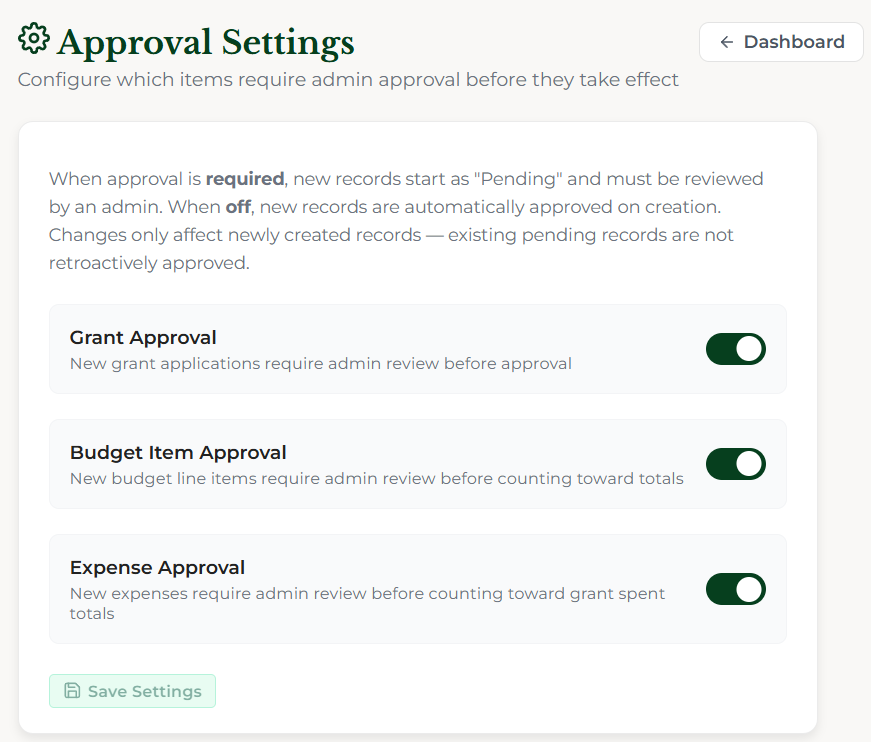

3. Three toggle switches control approval workflows:

| Toggle | When ON | When OFF |
|--------|---------|----------|
| **Grant Approval** | New grants start as "Pending" and must be reviewed | New grants are immediately approved |
| **Budget Item Approval** | New budget items must be reviewed before counting toward totals | Budget items are immediately approved |
| **Expense Approval** | New expenses must be reviewed before counting toward spent totals | Expenses are immediately approved |

4. Flip the toggles as needed

   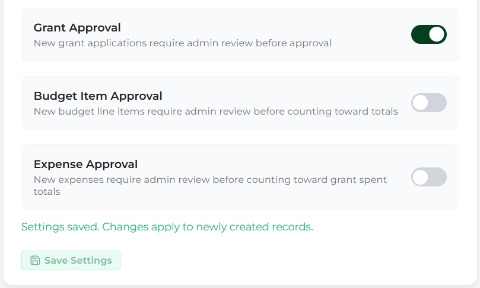

5. Click **Save Settings** (the button is disabled until you make a change)
6. Success message: "Settings saved. Changes apply to newly created records."

> ℹ️ Changes only affect newly created records. Existing pending records are not retroactively approved.

---

## 10. Viewing the Audit Log

1. Click your **profile icon** → **Audit Log**

   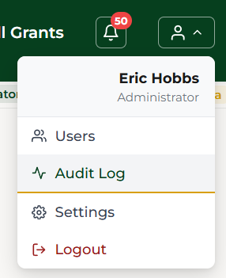

2. The audit log shows every insert, update, and delete across grants, budget items, expenses, and users in your tenant

### Filtering

   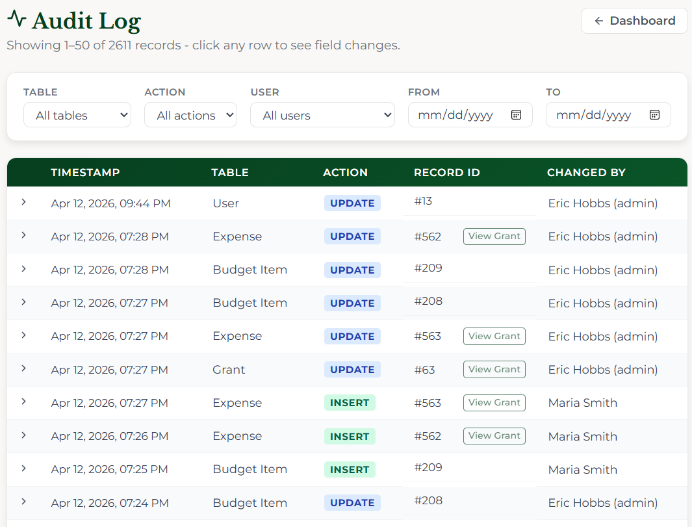

- **Table** dropdown: Filter by Grant, Budget Item, Expense, or User
- **Action** dropdown: Filter by Insert, Update, or Delete
- **User** dropdown: Filter by a specific user (admin users show an "(admin)" badge)
- **From / To** dates: Filter by date range
- Click **Clear** to reset filters

### Viewing Change Details

   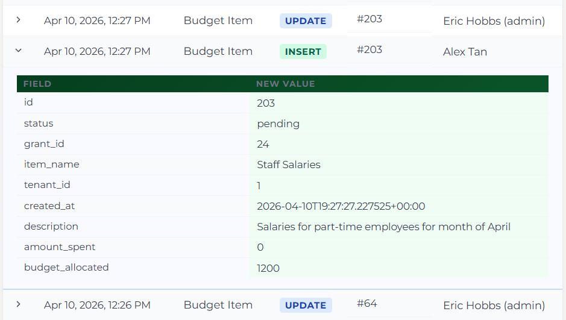

1. Click any row to expand it
2. Each action type has a color-coded badge (INSERT, UPDATE, DELETE)
3. The diff view shows which fields changed:
   - **INSERT**: Shows the new values
   - **UPDATE**: Shows old → new for only the fields that actually changed (system fields like `updated_at` are filtered out)
   - **DELETE**: Shows the deleted values

4. For grant-related records, a **View Grant** link appears inline, taking you to the review page

   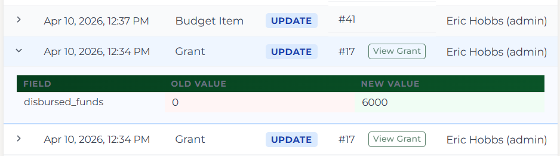

### Pagination

The audit log shows 50 entries per page. Use the **Prev** and **Next** buttons at the bottom to navigate between pages.

---

## 11. Notifications

The notification bell works the same as for grantees. As an admin, you'll receive notifications when:

- A new grant is submitted for review
- A grant is resubmitted after changes

   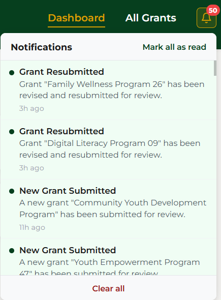

See the Grantee Walkthrough Section 12 for full notification panel details.

---

## 12. Configuring Support Contact

Tenant admins can set a custom support email and phone number that appears in the footer for all users in their tenant.

1. Go to **Settings** (from the profile dropdown)
2. Scroll down to the **Support Contact** section

   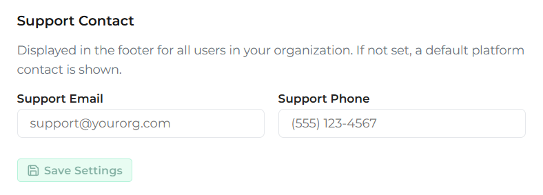

3. Enter the **Support Email** and **Support Phone** for your tenant
4. Click **Save Settings**

If left blank, the platform-wide defaults (set by the super admin) are shown instead, and a banner appears on the dashboard notifying you to set it for your tenant.

---

## 13. Managing Grantee Subscriptions

Grantees need an active subscription (Basic or Premium) to access grants and expenses. As a tenant admin, you can view each grantee's subscription status and waive the requirement for individual users.

> ℹ️ Admins and super admins are automatically exempt from subscription requirements.

### Viewing Subscription Status

The **Subscription** column on the User Management page shows each grantee's current status at a glance. See the badge table in Section 7 for details.

### Waiving a Subscription

If a grantee should have access without paying (e.g. a sponsored user or a test account):

1. Go to **Users** from the profile dropdown
2. Find the grantee in the table
3. Click **Waive** in the Actions column

The grantee's Subscription badge changes to **Waived** (purple) and they receive full access (Premium-level) without a Stripe subscription. The grantee's Subscription page will show: *"Premium (subscription waived by your administrator)"*.

> ℹ️ If the grantee already has a Stripe subscription, the waiver overrides it. Their Stripe subscription continues independently — the grantee can cancel it via the billing portal on their Subscription page.

### Removing a Waiver

1. Find the waived grantee in the user table (Subscription badge shows "Waived")
2. Click **Remove Waiver** in the Actions column
3. The grantee's badge changes to **None** and they will need to purchase a subscription to regain access

> ⚠️ Removing a waiver takes effect immediately. The grantee will be redirected to the Subscription page on their next page load.

### What Admins Cannot Do

- Admins cannot change a grantee's Stripe subscription tier (Basic ↔ Premium). The grantee manages this via their Subscription page
- Admins cannot exempt the entire tenant from subscriptions. This is a super admin action (see the Super Admin Walkthrough)
