# Super Admin Step-by-Step Walkthrough

This guide walks through every task a *super admin* can perform in GrantTrail. 

> **Who is a super admin?** Super admins manage tenants across the platform but do not interact with grants or expenses directly. A user with `role = 'super_admin'` in the `users` table. This role is not available through the UI. It must be set directly in the database.

> **Tenant** = the entity that is responsible for reviewing, approving, rejecting and managing grants. 
> **Organization** = the entity that the grantee represents or works for (entered by each grantee during signup). 
> For example, TFAC is a tenant. They use GrantTrail to manage grants. Each invited grantee enters their own organization name (e.g., "Helping Hands Foundation"), so TFAC manages grantees from Helping Hands, Hope Foundation, and others. For self-service, tenant and organization are the same.

## Table of Contents

- [Quick Reference](#quick-reference)
- [1. Logging In](#logging-in)
- [2. Viewing All Tenants](#viewing-all-tenants)
- [3. Creating a Managed Tenant](#creating-a-managed-tenant)
- [4. Understanding Tenant Types](#understanding-tenant-types)
- [5. How Self-Service Signup Works](#how-self-service-signup-works)
- [6. How Invite Signup Works](#how-invite-signup-works)
- [7. Monitoring the Platform](#monitoring-the-platform)
- [8. Disabling and Enabling a Tenant](#disabling-and-enabling-a-tenant)
- [9. Platform Default Settings](#platform-default-settings)
- [10. Managing Tenant Subscriptions](#managing-tenant-subscriptions)

---

## Quick Reference

| I want to... | Where to go | What to do |
|------------|-------------|------------|
| **Create a managed tenant** | Tenants → Create Tenant | Enter tenant name and admin email, share the generated invite link |
| **Disable a tenant** | Tenants → Actions column | Click Disable, and confirm. All tenant users are locked out |
| **Enable a tenant** | Tenants → Actions column | Click Enable, and confirm. Users can log in again |
| **Set default support contact** | Tenants → Platform Defaults (bottom) | Enter email and phone, click Save |
| **Filter tenants** | Tenants page toolbar | Use search, type dropdown, status dropdown, or date range |
| **Exempt a tenant from subscriptions** | Tenants → Subscription column | Click "Required" to toggle to "Exempt" (see Section 10) |
| **Require subscriptions for a tenant** | Tenants → Subscription column | Click "Exempt" to toggle back to "Required" (see Section 10) |

**Tenant types:**

| Aspect | Managed | Self-service |
|--------|---------|--------------|
| **Signup** | Invite-based (admin generates invite link) | Open (user signs up at `/signup`) |
| **Approval workflows** | Configurable per tenant via `/admin/settings` | Always off |
| **Admin role** | Available | Blocked by `enforce_self_service_role` trigger |
| **Use case** | Organizations with formal grant review | Individual users or small teams tracking expenses |

**Not yet available:**

- Converting self-service → managed (Requires database changes)
- Viewing data within a tenant (No UI for this. Log in as a tenant user or query database)
- Deleting a tenant (CASCADE delete supported at DB level but no UI)

---

## 1. Logging In

1. Go to `/login`
2. Enter your **Email** and **Password**
3. Click **Log In**
4. You're redirected to the **Tenant Management** page (`/super/tenants`)

   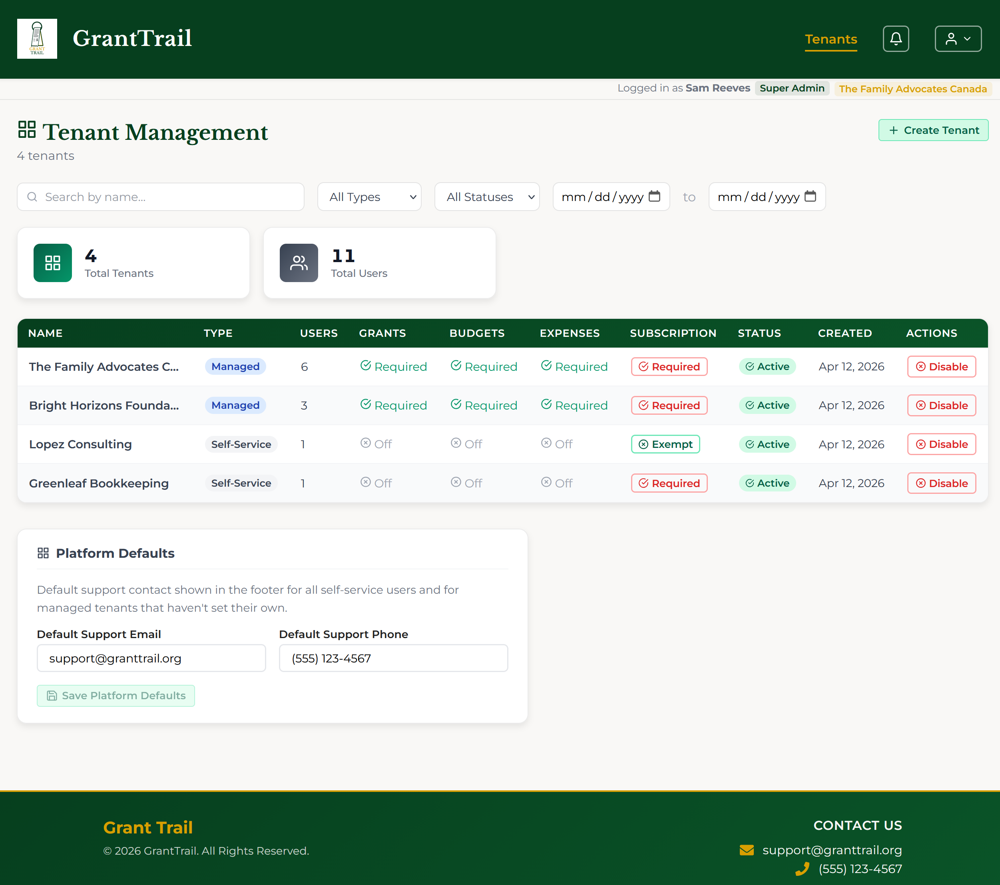

A **user bar** at the top of the page shows your name and a "Super Admin" role badge. The header shows only a **Tenants** nav link. Super admins do not have access to Dashboard, Grants, Users, Audit Log, or Settings. Those features are scoped to individual tenants.

---

## 2. Viewing All Tenants

   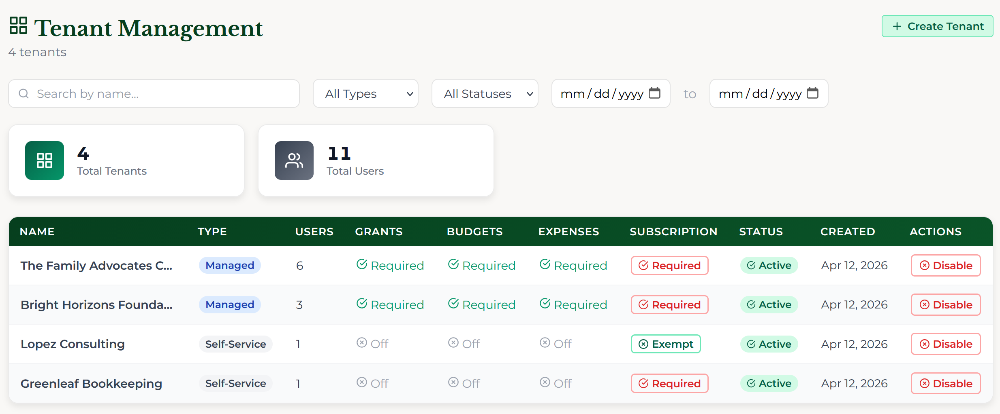

### Stat Cards

   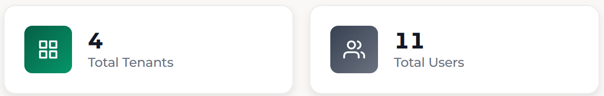

- **Total Tenants**: Number of tenants on the platform
- **Total Users**: Combined user count across all tenants (platform-wide total)

### Search

   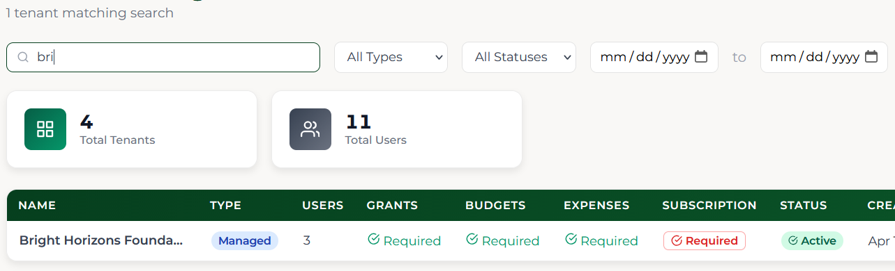

Type in the search bar to filter tenants by name. A subtitle below the heading updates to show the count (e.g. "3 tenants matching search"). Use the **Type** dropdown (Managed/Self-service), **Status** dropdown (Active/Disabled), and **date range** filters (Created from/to) to narrow results further. Date range filters prevent selecting invalid ranges (e.g. "from" after "to").

### Tenant Table

   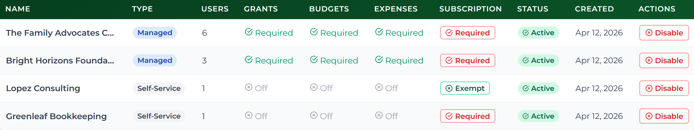

| Column | Description |
|--------|-------------|
| **Name** | Tenant name (hover for full name tooltip) |
| **Type** | Managed (blue badge) or Self-service (grey badge) |
| **Users** | Number of users in the tenant |
| **Grants** | "Required" (green checkmark) or "Off" (grey X) |
| **Budgets** | "Required" (green checkmark) or "Off" (grey X) |
| **Expenses** | "Required" (green checkmark) or "Off" (grey X) |
| **Subscription** | "Required" (clickable) or "Exempt" (clickable) — toggles whether grantees in this tenant need a subscription (see Section 10) |
| **Status** | "Active" (green checkmark) or "Disabled" (red X) |
| **Created** | Date the tenant was created |
| **Actions** | "Disable" or "Enable" |

---

## 3. Creating a Managed Tenant

Use this for organizations that need formal grant review workflows (like TFAC).

1. Click **Create Tenant**

   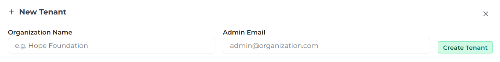

2. Enter the **Organization Name** (e.g. "Hope Foundation")
3. Enter the **Admin Email**: The first administrator for this tenant

   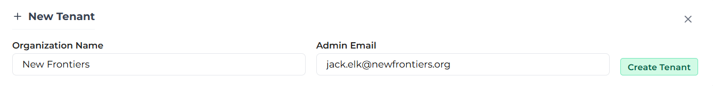

4. Click **Create Tenant**
5. The system creates the tenant, settings (all approvals on), and an admin invite
6. An **invite link** is displayed. Click **Copy** to copy it to your clipboard. The button briefly changes to "Copied!" as confirmation. Share this link with the admin.

   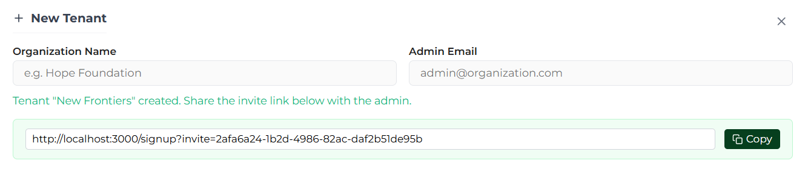

> ℹ️ After creation, the form fields are locked. Close the create form and reopen it to create another tenant.

7. The tenant appears in the table with all approval settings showing "Required"

   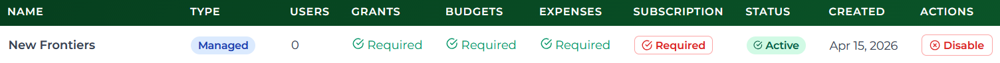

### What Happens Next

1. The admin receives the invite link and signs up at `/signup?invite=<token>`
2. They are assigned to the new tenant with the **admin** role
3. The admin can then invite grantees from the **User Management** page

---

## 4. Understanding Tenant Types

| Aspect | Managed | Self-service |
|--------|---------|--------------|
| **How users join** | Via invite link from a tenant admin | Open signup at `/signup` (auto-provisions tenant) |
| **Approval workflows** | Configurable. Admin can toggle on/off | Always off |
| **Admin role** | Available. Can review grants, manage users | Not allowed (blocked by database trigger) |
| **Grant lifecycle** | Pending → Approved/Rejected/Needs Changes | Submitted → Immediately Approved |
| **Use case** | Organizations with formal grant review | Individuals or small teams tracking expenses |

---

## 5. How Self-Service Signup Works

When a user signs up at `/signup` without an invite token:

1. User enters their **email and password** on the signup page

   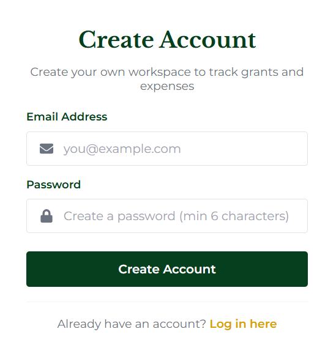

2. If email verification is enabled, they verify their email first
3. They're taken to the **Complete Your Profile** page where they enter their name, phone, and organization name
4. On completing their profile, the system calls `provision_self_service_tenant()` which atomically creates:
   - A new **tenant** (type: `self_service`)
   - **Tenant settings** (all approvals off)
   - A **user record** (role: `grantee`, linked to the new tenant)

5. If the tenant requires a subscription (default), the user lands on the **Subscription** page to choose a plan. Otherwise, they land on their dashboard.

   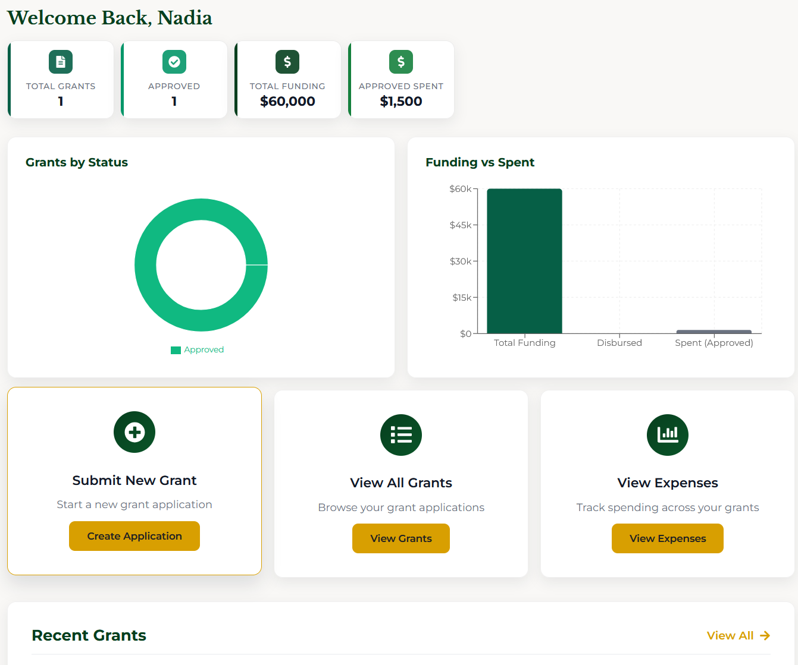

6. The new tenant appears in your tenant management table with Subscription set to "Required". You can exempt this tenant from subscriptions (see Section 10).

---

## 6. How Invite Signup Works

When a tenant admin generates an invite link:

1. Admin clicks **Invite User** on the User Management page
2. Selects a role and optionally enters an email
3. Generates a link like `/signup?invite=abc123`

   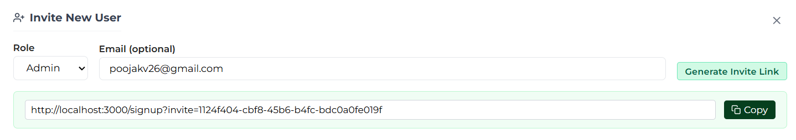

4. The invited user clicks the link and sees the signup page with their invitation details

   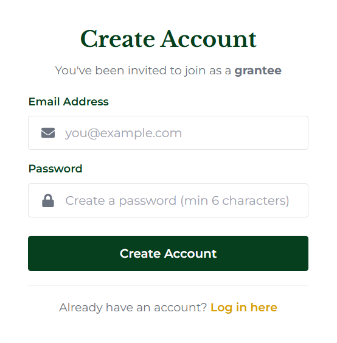

5. User enters their **email and password** and clicks **Create Account**
6. If email verification is enabled, they verify their email first
7. They complete their profile (name, phone, organization) on the **Complete Your Profile** page
8. The invite is marked as used (can't be reused)
9. If the tenant requires a subscription, the grantee lands on the **Subscription** page. The tenant admin can waive this per user (see the Admin Walkthrough Section 13).
10. The user appears in the tenant's user list with the correct role

---

## 7. Monitoring the Platform

### Checking Tenant Health

Review the tenant table regularly for:

- **User counts**: Are tenants growing?
- **Approval settings**: Are managed tenants configured correctly?
- **Subscription status**: Are tenants set to "Required" or "Exempt" as intended?
- **New self-service signups**: New tenants appearing automatically

### What You Can See vs. What You Can't

| Can see | Cannot see (yet) |
|---------|-----------------|
| Tenant names, types | Individual grants or expenses within a tenant |
| User counts per tenant | Specific user details within a tenant |
| Approval settings | Audit logs across tenants |
| When tenants were created | Tenant usage metrics or activity |

---

## 8. Disabling and Enabling a Tenant

Disabling a tenant locks out all users in that tenant. They'll see an "Account Disabled" screen on their next login or page refresh.

### Disabling a Tenant

1. Find the tenant in the table
2. Click **Disable** in the Actions column
3. An inline confirmation appears: "Disable?" with **Yes** and **No** buttons (click **No** to cancel)

   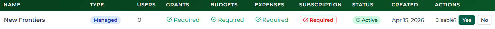

4. Click **Yes** to confirm
5. The tenant status changes to "Disabled"

   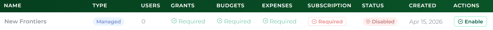

All users in the disabled tenant will be signed out and blocked from logging in.

### Re-enabling a Tenant

1. Click **Enable** next to the disabled tenant
2. An inline confirmation appears: "Enable?" with **Yes** and **No**
3. Click **Yes** to confirm
4. Users can log in again immediately

---

## 9. Platform Default Settings

The super admin can set default support contact information that appears in the footer for tenants that haven't configured their own.

1. Scroll to the **Platform Defaults** section below the tenant table

   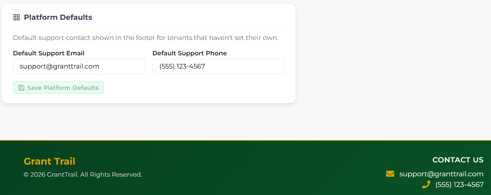

2. Enter the **Default Support Email** and **Default Support Phone**

   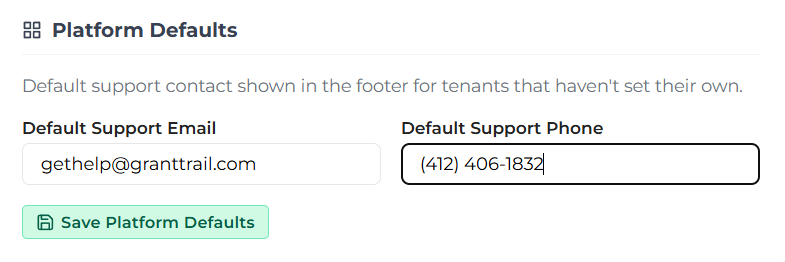

3. Click **Save Platform Defaults** (the button is disabled until you make a change)

4. Refresh the page to see the updated footer

   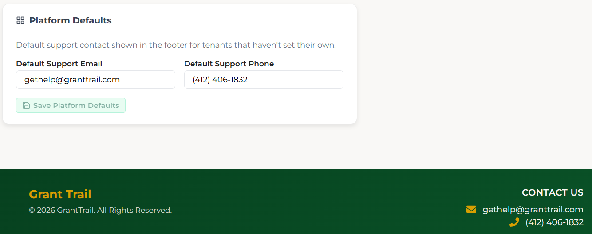

### How the footer contact info works

| Priority | Source | Who sets it |
|----------|--------|-------------|
| 1st | Tenant-specific settings | Tenant admin (via `/admin/settings`) |
| 2nd | Platform defaults | Super admin (via `/super/tenants`) |
| 3rd | Hardcoded fallback | Built into the app (`support@granttrail.org` / `(555) 123-4567`) |

If a tenant admin sets their own support email/phone, that takes priority. Otherwise the platform defaults are shown. If neither is configured, the hardcoded fallbacks are used.

---

## 10. Managing Tenant Subscriptions

By default, all tenants require grantees to have an active subscription (Basic or Premium) to access grants and expenses. Super admins can exempt individual tenants from this requirement.

> ℹ️ Admins and super admins are always exempt from subscriptions regardless of tenant settings.

### The Subscription Column

The **Subscription** column in the tenant table shows the current requirement for each tenant:

| State | Meaning |
|-------|---------|
| **Required** | Grantees in this tenant must purchase a subscription to access the app |
| **Exempt** | Grantees have full access without a subscription |

### Exempting a Tenant

1. Find the tenant in the table
2. Click the **Required** button in the Subscription column
3. The button changes to **Exempt**
4. All grantees in this tenant now have full access without needing to subscribe
5. Grantees who are logged in will see the change after refreshing their session

### Requiring Subscriptions Again

1. Find the exempt tenant in the table
2. Click the **Exempt** button in the Subscription column
3. The button changes back to **Required**
4. Grantees without an active Stripe subscription will be redirected to the Subscription page on their next page load

> ℹ️ For self-service tenants, toggling back to "Required" automatically removes any manual subscription waivers for that tenant's users. This does not apply to managed tenants, where waivers are managed individually by the tenant admin.

### When to Exempt a Tenant

Common scenarios:

- **TFAC's own grantees**: The managing organization's grantees may not need to pay for access
- **Sponsored tenants**: An external organization is paying on behalf of their users
- **Trial or evaluation**: Allow a tenant to explore the platform before committing to subscriptions

### Subscription vs. Individual Waivers

| Level | Who sets it | Scope | Use case |
|-------|------------|-------|----------|
| **Tenant-level exemption** | Super admin | All grantees in the tenant | Organization-wide access |
| **Individual waiver** | Tenant admin | Single grantee | Sponsored user, test account |

Tenant admins can waive subscriptions for individual grantees from their User Management page (see Admin Walkthrough Section 13). Tenant-level exemption set by the super admin overrides the need for individual waivers.
