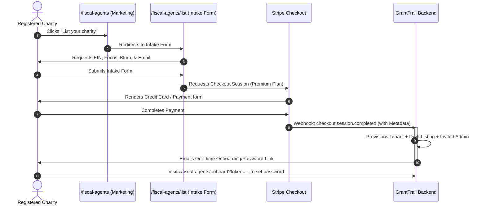

# GrantTrail Pricing & Subscription Design Proposal

As a Product Manager, designing a monetization model for a two-sided B2B platform (Fiscal Agents / Charities on one side, and Grassroots Grantees / Projects on the other) requires balancing **transactional friction** against **platform value capture**.

Below is a strategic analysis of the current pricing model, followed by a proposed, unified subscription structure.

---

## 1. Core Strategic Recommendations

### A. Batching Directory Access into the Grantee Subscription
* **The Problem:** Gating the directory search behind a third, independent SKU (`directory_access`) creates a high-friction discovery phase. Grant seekers are forced to pay before knowing if a suitable sponsor exists, which drastically reduces user acquisition and onboarding rates.
* **The Recommendation:** **Batch Directory Viewing into the Basic/Premium subscription.** 
  * Any user with a **Basic Grantee** account should be able to search the directory and view full profiles.
  * **Freemium Teaser:** Keep a public, non-authenticated search where anyone can view name, location, and focus areas, but restrict "Apply / View Contact Info" to logged-in, subscribed users.
  * **Value Alignment:** Monetize the *relationship management* and *grant execution* rather than the *database lookups*.

### B. Invitee Subscription Economics: Who Pays?
* **The Problem:** If a Fiscal Agent invites a grassroots project (grantee), forcing that project to enter their own credit card and pay $X/month creates severe operational friction. Grassroots projects are often volunteer-led or low-budget; a billing hurdle may cause them to refuse using GrantTrail, forcing the Fiscal Agent back to manual spreadsheets and PDF receipts.
* **The Recommendation:** **Implement a B2B Sponsor-Pays Model (Seat / Grantee Quotas).**
  * Grantees invited by a managed Fiscal Agent should **not** pay directly.
  * Instead, the Fiscal Agent's **Premium Subscription** should include a built-in seat quota (e.g., up to 5 active grantees included) and scale dynamically (e.g., +$10/month per active grantee beyond the threshold).
  * This leverages the existing **Waiver system** automatically behind the scenes (auto-waiving invited grantees of paid tenants).

---

## 2. Proposed Pricing Model & Tier Matrix

By consolidating from three disjointed SKUs down to two primary customer journeys (Seeker and Sponsor), we simplify the value proposition.

| Tier | Target Persona | Monthly Price (Est.) | Key Capabilities | Directory Rights | Billing Flow |
| :--- | :--- | :--- | :--- | :--- | :--- |
| **Basic (Grantee)** | Independent Projects / Grassroots Orgs | **$12 - $19 / mo** | - Submit grants<br>- Track budgets & log expenses<br>- Upload receipts & documents | **Search & View Full Profiles**<br>(Apply/Contact sponsors directly) | Paid by project (Self-Service) OR covered by Sponsor's seat quota |
| **Premium (Fiscal Agent)** | Registered 501(c)(3) Charities / Fiscal Sponsors | **$49 - $99 / mo** | - Admin dashboard & review queue<br>- Custom approval workflows<br>- Multi-organization audit logs<br>- Export to Excel | **Own & Publish Listing**<br>(Triage inquiries, onboard projects directly as grantees) | **Pay-First Onboarding**<br>(Intake form → Stripe payment → Magic setup link) |

---

## 3. Detailed Workflow Maps

### A. Charity / Fiscal Agent Onboarding (Pay-First)
To keep the directory high-quality and prevent spam, charities must pay before their listing or account is provisioned:



### B. Seeker / Grantee Matching Lifecycle
```mermaid
graph TD
    A[Public Directory View] -->|Teaser / Blurred Contact Info| B(Requires Log In / Signup)
    B --> C{Active Subscription?}
    C -->|No| D[Nudge to Subscribe to Basic Plan]
    C -->|Yes: Basic / Premium / Exempt| E[Unlock Full Profiles & "Apply for Sponsorship" Button]
    E --> F[Grantee Submits Structured Sponsorship Application]
    F --> G[Application Lands in Charity's Inbox /fiscal-agents/me/inbox]
    G -->|Charity Clicks Accept| H[Onboard as Grantee button matches & auto-registers Project under Charity's Tenant]
```

---

## 4. Key Implementation Steps (If Approved)

1. **Modify `frontend/src/lib/policy.js`:**
   * Update `canViewDirectory(session)` to return `true` if `hasBasicAccess` is true (batching directory access into the basic grantee subscription).
2. **Update the Stripe Webhook (`supabase/functions/stripe-webhook/index.ts`):**
   * Ensure that when a charity completes the pay-first checkout session, the tenant is set up and an invite token is generated correctly.
3. **Auto-Waiver on Invite:**
   * Adjust the database trigger or api when a tenant admin invites a grantee, so that the grantee is automatically set to `exempt` or `waived` under a paid Fiscal Agent tenant.
