```mermaid
erDiagram

  tenants {
    int       id              PK
    varchar   name
    varchar   slug            "unique"
    varchar   tenant_type     "managed | self_service"
    boolean   is_active       "default: true"
    timestamptz created_at
  }

  tenant_settings {
    int       tenant_id       PK "→ tenants.id"
    boolean   require_grant_approval
    boolean   require_budget_approval
    boolean   require_expense_approval
    boolean   require_subscription
    varchar   support_email   "nullable"
    varchar   support_phone   "nullable"
  }

  platform_settings {
    int       id              PK "always 1"
    varchar   default_support_email
    varchar   default_support_phone
  }

  invites {
    int       id              PK
    int       tenant_id       FK "→ tenants.id"
    uuid      token           "unique"
    varchar   role            "admin | grantee"
    varchar   email           "optional"
    uuid      created_by      FK "→ auth.users.id"
    uuid      used_by         FK "→ auth.users.id"
    timestamptz used_at
    timestamptz expires_at
    timestamptz created_at
  }

  users {
    int       id              PK
    int       tenant_id       FK "→ tenants.id"
    uuid      user_id         FK "→ auth.users.id"
    varchar   firstname
    varchar   lastname
    varchar   organization_name
    varchar   email
    varchar   phone_number
    varchar   role            "admin | grantee | super_admin"
    boolean   is_active       "default: true"
    int       tax_month       "1-12, nullable"
    timestamptz created_at
  }

  grant_record {
    int       id              PK
    int       tenant_id       FK "→ tenants.id"
    int       user_id         FK "→ users.id"
    varchar   grant_name
    text      description
    date      start_spend_period
    date      end_spend_period
    date      release_date
    decimal   grant_amount
    decimal   disbursed_funds
    decimal   total_spent     "auto: sum of expenses"
    decimal   remaining_balance "auto: grant_amount - total_spent"
    varchar   status          "pending|approved|needs_changes|rejected"
    timestamptz submitted_at
    timestamptz reviewed_at
    uuid      reviewer_id     FK "→ auth.users.id"
    text      approval_notes
    timestamptz created_at
    timestamptz updated_at
  }

  budget_items {
    int       id              PK
    int       tenant_id       FK "→ tenants.id"
    int       grant_id        FK "→ grant_record.id"
    varchar   item_name
    text      description
    decimal   budget_allocated
    decimal   amount_spent    "auto: sum of expenses"
    timestamptz created_at
    timestamptz updated_at
  }

  expenses {
    int       id              PK
    int       tenant_id       FK "→ tenants.id"
    int       grant_id        FK "→ grant_record.id"
    int       budget_item_id  FK "→ budget_items.id"
    varchar   item_name
    decimal   amount_spent
    date      expense_date
    timestamptz created_at
    timestamptz updated_at
  }

  receipts {
    int       id              PK
    int       tenant_id       FK "→ tenants.id"
    int       user_id         FK "→ users.id"
    int       grant_id        FK "→ grant_record.id"
    int       expense_id      FK "→ expenses.id"
    json      receipt_files   "[ {name, path, type, size} ]"
    timestamptz created_at
  }

  grant_attachments {
    int       id              PK
    int       tenant_id       FK "→ tenants.id"
    int       grant_id        FK "→ grant_record.id"
    varchar   file_name
    text      file_path
    varchar   file_type
    bigint    file_size
    uuid      uploaded_by     FK "→ auth.users.id"
    text      description
    varchar   category        "proposal|budget|report|general"
    timestamptz created_at
  }

  grant_status_history {
    int       id              PK
    int       tenant_id       FK "→ tenants.id"
    int       grant_id        FK "→ grant_record.id"
    varchar   old_status
    varchar   new_status
    uuid      changed_by      FK "→ auth.users.id"
    text      comment
    timestamptz created_at
  }

  grant_comments {
    int       id              PK
    int       tenant_id       FK "→ tenants.id"
    int       grant_id        FK "→ grant_record.id"
    uuid      user_id         FK "→ auth.users.id"
    text      comment
    timestamptz created_at
  }

  audit_log {
    int       id              PK
    int       tenant_id       FK "→ tenants.id"
    varchar   table_name
    int       record_id
    varchar   action          "INSERT|UPDATE|DELETE"
    uuid      changed_by      FK "→ auth.users.id"
    jsonb     old_values
    jsonb     new_values
    timestamptz created_at
  }

  notifications {
    int       id              PK
    int       tenant_id       FK "→ tenants.id"
    int       user_id         FK "→ users.id"
    varchar   type            "grant_approved|expense_rejected|etc"
    varchar   title
    text      message
    text      link            "optional in-app route"
    boolean   is_read         "default: false"
    timestamptz created_at
  }

  subscriptions {
    int       id              PK
    int       user_id         FK "→ users.id"
    varchar   stripe_customer_id
    varchar   stripe_subscription_id "unique"
    varchar   stripe_product_id
    varchar   stripe_price_id
    varchar   membership_tier "basic | premium"
    varchar   status
    timestamptz current_period_start
    timestamptz current_period_end
    boolean   cancel_at_period_end
    timestamptz canceled_at
    jsonb     metadata
    timestamptz created_at
    timestamptz updated_at
  }

  user_memberships {
    int       id              PK
    int       user_id         FK "→ users.id, unique"
    int       subscription_id FK "→ subscriptions.id"
    varchar   membership_tier "basic | premium"
    boolean   is_active
    timestamptz starts_at
    timestamptz ends_at
    varchar   source          "stripe | manual | legacy"
    timestamptz created_at
    timestamptz updated_at
  }

  billing_customers {
    int       id              PK
    int       user_id         FK "→ users.id, unique"
    varchar   stripe_customer_id "unique"
    timestamptz created_at
  }

  billing_webhook_events {
    int       id              PK
    varchar   stripe_event_id "unique"
    varchar   event_type
    jsonb     payload
    timestamptz processed_at
  }

  feature_entitlements {
    int       id              PK
    int       grantee_id      FK "→ users.id"
    varchar   feature_key
    boolean   enabled
    varchar   source
    timestamptz created_at
    timestamptz updated_at
  }

  users           ||--o{ grant_record         : "owns"
  users           ||--o{ notifications        : "receives"
  grant_record    ||--o{ budget_items          : "has"
  grant_record    ||--o{ expenses              : "has"
  budget_items    ||--o{ expenses              : "categorizes"
  expenses        ||--o| receipts              : "has receipt"
  users           ||--o{ receipts              : "owns"
  grant_record    ||--o{ receipts              : "has"
  grant_record    ||--o{ grant_attachments     : "has"
  grant_record    ||--o{ grant_status_history  : "tracks"
  grant_record    ||--o{ grant_comments        : "has"
  grant_record    ||--o{ audit_log             : "logged in"
  tenants         ||--|| tenant_settings    : "configured by"
  tenants         ||--o{ invites            : "has"
  tenants         ||--o{ users              : "has"
  users           ||--o| billing_customers    : "has customer profile"
  users           ||--o{ subscriptions        : "subscribes"
  users           ||--o| user_memberships     : "holds"
  subscriptions   ||--o{ user_memberships     : "grants"
  users           ||--o{ feature_entitlements : "allocated overrides"
```

# Entity Relationship Diagram

The diagram below uses [Mermaid](https://mermaid.js.org) syntax and renders automatically in GitHub, GitLab, VS Code (with the Markdown Preview Mermaid Support extension), and most modern documentation tools.

For full column details, constraints, and triggers, refer to `backend/01-Complete-Fresh-Setup.sql`.

---



---

## Two ID Systems

The `users` table has two identity columns:

```
auth.users.id  (UUID)  ←→  users.user_id  (UUID column — the join point to Auth)
                                   ↕
                            users.id  (integer SERIAL — the PK used as FK everywhere else)
```

- `users.user_id` links the app's user record to Supabase Auth
- `users.id` (integer) is used as the FK in `grant_record.user_id`, `receipts.user_id`, etc.
- `grant_comments.user_id` is the exception — it stores the UUID directly, not the integer PK
